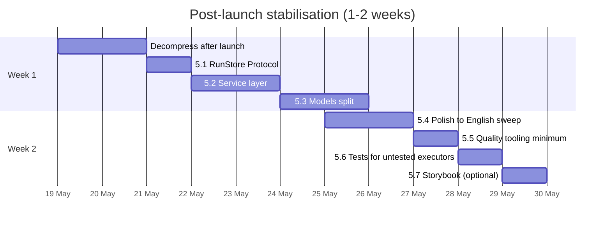
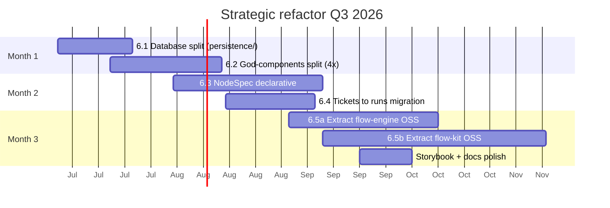
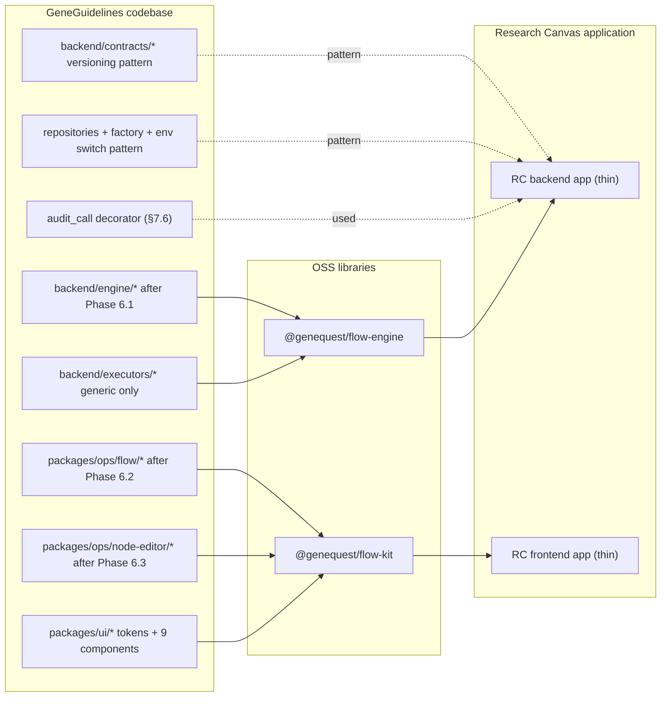
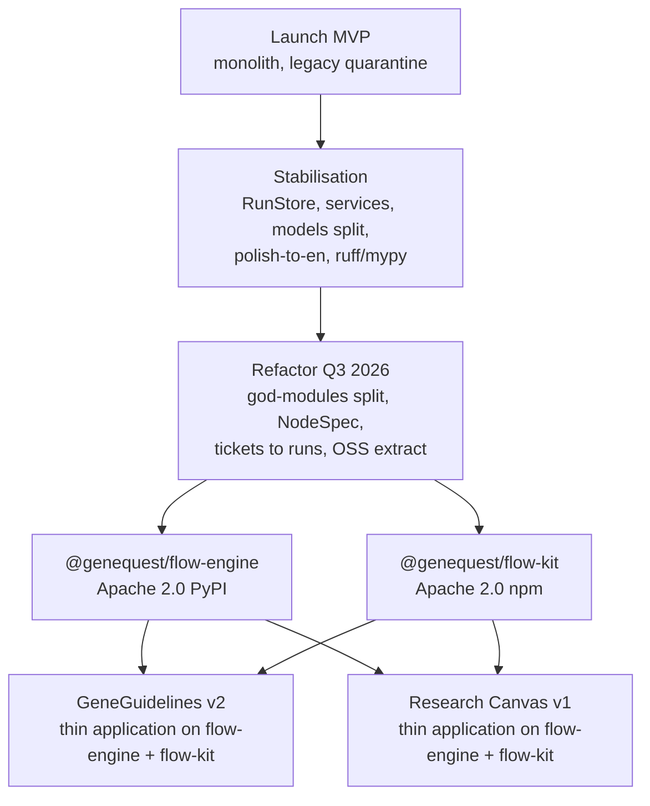

# Engineering Vision — From MVP to Research Canvas

This document is the strategic engineering roadmap for **GeneGuidelines**, a clinical-guidelines workflow engine for rare genetic diseases (FastAPI + Pydantic AI + MCP + React + React Flow). It synthesises the current state of the codebase, articulates a three-phase plan (pre-launch stabilisation, post-launch consolidation, and a strategic refactor), and describes the design patterns we want every new component to follow. The horizon is the **Research Canvas (RC)** — a researcher-facing product built on the same shared workflow stack — and the two OSS libraries (`@genequest/flow-engine`, `@genequest/flow-kit`) that we plan to extract once the foundations are in place.

The document is complementary to [`ARCHITECTURE.md`](ARCHITECTURE.md), which explains *what* the system is. This one explains *what we do next* with the system. [`ROADMAP.md`](ROADMAP.md) is the executive summary of the same content if you only have time for the top-level decisions.

---

## Table of contents

1. [TL;DR](#1-tldr)
2. [Current state — synthesis of three audits](#2-current-state--synthesis-of-three-audits)
3. [What's already good — don't break it](#3-whats-already-good--dont-break-it)
4. [Phase 1 — PRE-LAUNCH](#4-phase-1--pre-launch)
5. [Phase 2 — STABILISATION (1–2 weeks after submission)](#5-phase-2--stabilisation-12-weeks-after-submission)
6. [Phase 3 — STRATEGIC REFACTOR (Q3 2026)](#6-phase-3--strategic-refactor-q3-2026)
7. [Patterns for new components (RC-ready)](#7-patterns-for-new-components-rc-ready)
8. [GG → RC migration map](#8-gg--rc-migration-map)
9. [Quality tooling roadmap](#9-quality-tooling-roadmap)
10. [Risks, non-goals, open questions](#10-risks-non-goals-open-questions)

---

## 1. TL;DR

### 1.1 One-paragraph verdict

The **GeneGuidelines** codebase is a credible foundation both for the upcoming launch and for the longer-term **Research Canvas** vision (Q3 2026). The architecture has a **solid skeleton** — executor plugin pattern, `contracts/` folder, repositories + factory on the public frontend, design tokens, TypeScript strict mode everywhere, 309 backend tests — but it also has **three god-modules** in the backend (`database.py` 2651 LOC, `engine/flow_engine.py` 2387 LOC, `agents/runner.py` 1366 LOC) and **four god-components** in the frontend (`AgentView.tsx` 2058 LOC, `ops/api/client.ts` 911, `FlowCanvas.tsx` 815, `NodeEditor.tsx` 796). The biomedical pivot is largely complete: there are no longer any third-party-system executor files in `backend/executors/`; the application title in `backend/main.py:36-41` is neutral ("GeneGuidelines API"); the prompts in `backend/agents/runner.py:394-396` and `backend/engine/flow_engine.py:1110-1115` are clean ("research assistant", "strict judge"); `backend/seed_data.json` contains only one biomedical ticket ("Fibrous dysplasia clinical guideline") and two flow keys (`pubmed`, `doctor_finder`); `README.md`, `CLAUDE.md`, and `docs/ARCHITECTURE.md` are all in English and biomedical-focused. What remains: the `integration_*` columns in `backend/database.py:2070-2079` (empty in seed), a handful of stale lines of legacy context in `backend/tools/agent_tools.py:171,636-647`, `integration_*` fields in `models.py` and `routers/flows.py`, Polish comments in `packages/ops`, and the legacy `tickets` table schema (kept per ADR 002). **Extracting the OSS libraries** (`@genequest/flow-engine` in Python and `@genequest/flow-kit` in TypeScript) is the right long-term strategy and addresses a real market gap, but it is a 3–6 month project — **not a weekend**.

### 1.2 The three phases


### 1.3 Three sentences to action

1. **Pre-launch:** wire the model decision (Gemma E4B vs OpenRouter free tier) → hide the admin UI → add LICENSE + SECURITY.md → sanity-check that the seed loads on a fresh DB → ship the monolith. **Do not refactor** god-modules.
2. **Stabilisation (1–2 weeks after submission):** introduce a `RunStore` Protocol (cut the engine off from `database.py`) → extract a `services/` layer → run a Polish-to-English sweep in `packages/ops` → enable Ruff + mypy + pre-commit. This unblocks everything that follows.
3. **Refactor (Q3 2026, ~3 months):** split the backend god-modules and frontend god-components → roll out NodeSpec declarative schema → migrate `tickets` → `runs` → extract `@genequest/flow-engine` + `@genequest/flow-kit` as separate libraries. After this RC can be a thin application on top of the shared stack.

---

## 2. Current state — synthesis of three audits

### 2.1 Top-10 largest backend files (LOC)

| # | LOC | File | What it does | Main pain |
|---|---:|---|---|---|
| 1 | 2651 | `backend/database.py` | SQLite access + schema + incremental migrations (`_ensure_*`) + seed + CRUD for tickets/comments/tools/flows | Everything persistence-related in one module; long `init_db` chain; legacy `integration_*` columns |
| 2 | 2387 | `backend/engine/flow_engine.py` | Flow orchestration: step + fork/parallel + context merging + agentic close + quality mode + memory hooks | Orchestration + policy + prompt strings + diagnostics all in one file |
| 3 | 1366 | `backend/agents/runner.py` | Pydantic AI + MCP agent loop, SSE/trace, fallbacks, ticket status updates | Multiple run modes, duplicated tool-handling paths, ticket plumbing |
| 4 | 1172 | `backend/content_db.py` | Content domain SQLite: diseases, guidelines, PRs, care pathways, catalog stats | Schema + publishing helpers in one place, but **better** organised than `database.py` |
| 5 | 1020 | `backend/tools/pubmed_runtime.py` | PubMed-facing tool implementations / runtime | Large tool surface in one module |
| 6 | 889 | `backend/tools/agent_tools.py` | Agent-callable tools; a few lines of legacy context strings remain | Mixed clinical + legacy tool docs |
| 7 | 605 | `backend/doctor_catalog.py` | Doctor catalog merge/slug/public projection | Domain rules in a single file |
| 8 | 523 | `backend/flows/pubmed/retrieval.py` | PubMed retrieval pipeline | Large pipeline in one module |
| 9 | 473 | `backend/database_flow_ensures.py` | Parametrised INSERT SQL for doctor_finder + parent_pathway + integration columns | SQL blobs adjacent to product flows |
| 10 | 457 | `backend/routers/agent.py` | Agent API: imports `database as db`, SSE, lazy-imports `flow_engine` | Transport + orchestration + persistence concerns |

### 2.2 Top-20 largest frontend files (LOC)

| # | LOC | File |
|---|---:|---|
| 1 | 2058 | `packages/ops/src/components/AgentView.tsx` |
| 2 | 911 | `packages/ops/src/api/client.ts` |
| 3 | 815 | `packages/ops/src/components/FlowCanvas.tsx` |
| 4 | 796 | `packages/ops/src/components/NodeEditor.tsx` |
| 5 | 647 | `packages/ops/src/components/DoctorFinderPanel.tsx` |
| 6 | 544 | `packages/ops/src/components/GovernanceView.tsx` |
| 7 | 462 | `frontend-public/src/views/GuidelinesView.tsx` |
| 8 | 425 | `packages/ops/src/views/WorkflowsWorkspace.tsx` |
| 9 | 377 | `packages/ops/src/components/PathwayRunPanel.tsx` |
| 10 | 337 | `packages/ui/src/components/AuthModal.tsx` |
| 11 | 332 | `packages/ops/src/data/flowData.ts` |
| 12 | 328 | `frontend-public/src/views/AboutView.tsx` |
| 13 | 319 | `packages/ops/src/components/GuidelineRunPanel.tsx` |
| 14 | 308 | `packages/ops/src/views/GuidelinePrsView.tsx` |
| 15 | 228 | `frontend-public/src/components/DiseaseTabs.tsx` |
| 16 | 222 | `frontend-public/src/data/guidelineDocuments.ts` |
| 17 | 211 | `frontend-public/src/views/DoctorProfileView.tsx` |
| 18 | 205 | `packages/ops/src/types/index.ts` |
| 19 | 204 | `packages/ops/src/views/RunsView.tsx` |
| 20 | 196 | `packages/ops/src/data/nodeStyles.ts` |

**Visual conclusion:** every god-component lives in `packages/ops/`. `frontend-public/` and `packages/ui/` are well-distributed (max 462 LOC). Pre-RC refactor is mostly a `packages/ops` exercise.

### 2.3 Test coverage map

```mermaid
flowchart TB
  subgraph BACKEND["backend (309 tests)"]
    direction TB
    b_pubmed["PubMed flow: 8+ files, ~1500 LOC"]
    b_doctor["Doctor finder: 14+ files, ~1700 LOC"]
    b_engine["Engine: parallel_fork_merge, merge_node, flow_engine_pubmed_context"]
    b_executors_yes["Executors covered: pubmed_authors_fetch, pmid_verifier, evaluation_check, doctor_finder_*, guidelines_rag, code_node_runner, parent_pathway_load/end"]
    b_executors_no["Executors NOT covered: approval, decision, http, prompt, agentic_prompt, sandbox_worker, parent_pathway_evidence, merge_executor (logic tested via flow_engine.merge_values)"]
    b_routers_yes["Routers covered: content, content_prs, doctor_finder, pipeline, agent (partially), security_api_auth"]
    b_routers_no["Routers NOT covered: tools, flows, tickets (except auth)"]
    b_database["database.py: NOT tested directly (only via integration)"]
  end

  subgraph FRONTEND["frontend (78 cases total)"]
    direction TB
    f_public["frontend-public: 44 Vitest + 1 Playwright"]
    f_ui["packages/ui: 33 Vitest + RTL + jsdom"]
    f_ops["packages/ops: ZERO tests"]
    f_admin["frontend-admin: ZERO tests"]
  end
```



**Critical test gaps:**

- `packages/ops` (~7000 LOC) and `frontend-admin` — **0 tests**, highest product risk for operator UI
- 8 executors without dedicated tests: `approval`, `decision`, `http`, `prompt`, `agentic_prompt`, `sandbox_worker`, `parent_pathway_evidence`, `code_executor` (thin wrapper)
- `routers/tools.py`, `routers/flows.py` — no dedicated tests
- `database.py` — only covered through integration tests, no unit tests for helpers

### 2.4 Layering violations (backend)

| Violation | Where | Note |
|---|---|---|
| Routers call `database` directly | `routers/agent.py`, `routers/pipeline.py`, `routers/tools.py`, `routers/tickets.py`, `routers/flows.py` | All use `from .. import database as db`. No repository / service layer. |
| Business logic in routers | `routers/agent.py`, `routers/pipeline.py` | The pipeline router creates tickets via `db.create_ticket` (lines 245, 303). The agent router runs SSE orchestration + lifecycle. |
| SQL/DB scattered | `database.py`, `content_db.py`, `guideline_run_store.py`, `doctor_finder_store.py`, `memory/postgres.py` | Multiple modules ship their own `CREATE TABLE`. |
| Pydantic vs DB | `models.py` "aligned with DB schema"; `content_models.py` for the content API | **Partial** separation. `models.py` still contains `integration_*` fields. |
| Domain logic in agents/executors | `agents/runner.py` (ticket tool handling, status updates), `tools/agent_tools.py` (legacy context), executors dispatch `flows/doctor_finder` steps | Executors are thin for many types; **fat** logic lives in `runner`, `flow_engine`, `tools`. |
| Engine reaches through to DB | `backend/engine/flow_engine.py:19` and `backend/engine/order.py:17-18` | `from .. import database as db` in both — topological sort is tied to the global `database` module instead of being an injected port. |

### 2.5 Legacy residue — what actually remains

The pivot from the previous target domain is largely done. The following helper modules **no longer exist**: any third-party identity/chat/email/issue-tracker executor; the previous workflow-suite client. What is left to clean up:

| Location | What | Severity |
|---|---|---|
| `backend/database.py:71-82` | `tickets` table — universal run handle | **Low** (ADR 002 keeps it) |
| `backend/database.py:2070-2079` | `_ensure_integration_columns()` — generic chat/issue-tracker/identity/email columns | **Low** (empty in production) |
| `backend/agents/agent.py:144-172` | Printer/hardware guard tools | **Low** (defensive, inactive) |
| `backend/tools/agent_tools.py:171,636-647` | ~4 lines of legacy product context strings | **Medium** (visible to reviewers if exposed in a demo flow) |
| `backend/tickets.db` | Filename of the application's SQLite database | **Low** (just a name) |
| `backend/routers/flows.py:69-73, 339-341` | Exposes `integration_operation` / params / credentials | **Medium** (the API contract still surfaces these fields; values are empty) |
| `backend/models.py` | `integration_*` fields in Pydantic models | **Medium** (API DTO contract) |
| `packages/ops/src/components/AgentView.tsx:45-57` | Hardcoded flow keys + labels (biomedical) | **Low** (`pubmed`, `doctor_finder`, `parent_pathway` — product-relevant, not legacy) |
| `packages/ops/src/components/AgentView.tsx:300-305` | Polish-language comments | **Low** (comments only, swept in Phase 2) |
| `packages/ops/src/types/index.ts`, `FlowCanvas.tsx`, `NodeEditor.tsx`, `nodeStyles.ts` | "integration" node type as enum value in `NODE_TYPES` / styles | **Low** (type definition — remove once backend `integration_*` is dropped) |

The rest is already clean:

| Location | State |
|---|---|
| `backend/main.py:36-41` | Title "GeneGuidelines API" |
| `backend/agents/runner.py:394-396` | Prompt: "You are a research assistant. MCP is disabled..." |
| `backend/engine/flow_engine.py:1110-1115` | Agentic close prompt: "You are a strict judge of one completed agent step..." |
| `backend/seed_data.json` | 1 biomedical ticket (FD), 2 biomedical flows (pubmed, doctor_finder); zero legacy seeds |
| `README.md` | English, biomedical-focused |
| `CLAUDE.md` | English, "developer context" |
| `docs/ARCHITECTURE.md` | English, public-facing system overview |

### 2.6 Polish vs English (sample)

- **`packages/ops`**: extensive **Polish** in JSDoc, comments, and **user-visible strings** (`DoctorFinderPanel`, `AgentView`, Polish comments in `api/client.ts`). The biggest pain point for OSS publication.
- **`frontend-public`**: primary UI copy is in **English** (e.g. `AboutView.tsx`).
- **`packages/ui`**: sampled `Button.tsx`, `AuthModal.tsx` — **English** comments and strings throughout.

### 2.7 Quality tooling — score 7/10

**What we have:**

- TypeScript strict mode everywhere + 0 `@ts-ignore` / `@ts-expect-error`
- ESLint flat config with `typescript-eslint` recommended + `react-hooks` + `react-refresh`
- Vitest for `frontend-public` and `packages/ui`
- Playwright for one E2E test
- 309 backend tests + `pytest`
- CI: `npm audit --audit-level=high` + lint + typecheck + test (public only) + build + pytest
- Monorepo scripts: `check:backend`, `check:public`, `check:ops`, `check:dev`

**What we don't have:**

- Python: no Ruff, no mypy, no Black, no `pyproject.toml` with tool config
- No Prettier (TS formatting is inconsistent)
- No `.pre-commit-config.yaml` or `.husky/` — git hooks enforce nothing
- `requirements.txt` is loosely pinned (`>=` only) — no `pip-tools` / `uv` lock
- `packages/ui` tests are NOT run in CI (they're defined in `package.json` but the root job doesn't invoke them)
- No Storybook
- `pip-audit` is not configured
- No coverage reports

---

## 3. What's already good — don't break it

These are patterns that work and should be **promoted** across the whole repo rather than replaced.

### 3.1 Executor plugin pattern

`backend/executors/__init__.py` exposes `EXECUTOR_REGISTRY: dict[str, type[NodeExecutor]]`. Every new node type = one new file in `executors/` + one line in the registry.

```python
EXECUTOR_REGISTRY = {
    "decision": DecisionExecutor,
    "prompt": PromptExecutor,
    "agentic_prompt": AgenticPromptExecutor,
    "code": CodeExecutor,
    ...
    "parent_pathway_end": ParentPathwayEndExecutor,
}
```

The contract is thin and legible:

```python
@dataclass(frozen=True)
class FlowRuntimeBundle:
    """Passed from flow_engine for nodes that need the live store / SSE hooks (e.g. LLM calls)."""

    store: dict[str, Any]
    event_queue: Any
    emit_fn: Any


@dataclass
class NodeInput:
    node_config: dict
    context: dict
    initial_data: dict
    flow_runtime: FlowRuntimeBundle | None = None


@dataclass
class NodeOutput:
    data: dict
    metadata: dict = field(default_factory=dict)
    branch: str | None = None


class NodeExecutor(ABC):
    @abstractmethod
    async def execute(self, input: NodeInput) -> NodeOutput: ...

    @classmethod
    def node_type(cls) -> str: ...
```

**Promote to RC:** same pattern, but `node_type()` returns a full `NodeSpec` (declarative properties) instead of just a string — see §6.3.

### 3.2 Contracts folder — versioned API contracts

`backend/contracts/agent_api_v1.py` demonstrates the **versioned API contracts** pattern in a single file:

```python
AGENT_API_CONTRACT_VERSION = "v1"

AgentTraceKind = Literal[
    "sys",
    "ai_summary",
    "diagnostic",
    "ticket_status",
    "missing_tool_request",
    "output",
    "technician_steps",
]


class AgentRunPayload(TypedDict):
    contract_version: str
    execution_id: str
    ticket_id: int
    done: bool
    error: str | None
    output: str | None
    structured_output: dict[str, Any] | None
    quality_snapshot: dict[str, Any] | None
    ai_summary: dict[str, Any]
    diagnostics_entries: list[Any]
    steps_completed_by_ai: list[Any]
    missing_tool_requests: list[Any]
```

Plus Pydantic models with `model_config = ConfigDict(extra="ignore", str_strip_whitespace=True)` for forward compatibility:

```python
class PubmedArticle(BaseModel):
    """Single PubMed article payload forwarded from pm-1 agent to pm-2 normalizer."""

    model_config = ConfigDict(extra="ignore", str_strip_whitespace=True)

    pmid: str = Field(..., min_length=1)
    title: str = ""
    authors: str = ""
    source: str = ""
    pubdate: str = ""
    doi: str = ""
    abstract: str = ""
    pubmed_url: str = ""
    doi_url: str = ""
    topic_bucket: TopicBucket = "general"
    pubtype: list[str] = Field(default_factory=list)
    evidence_tier: int = 6
    evidence_tier_label: str = ""
```

**Promote to RC:** every new API surface → new file in `contracts/`, versioned with a `_v1` / `_v2` suffix, and the contract holds a `*_CONTRACT_VERSION` constant + TypedDict + Pydantic model. The old monolithic `models.py` → fragmented into `contracts/{domain}_v1.py` per domain.

### 3.3 Repositories + factory + env switch (frontend-public)

`frontend-public/src/repositories/index.ts` exposes a `getRepositories()` factory with an env switch:

```typescript
const dataSource = getDataSource();
return dataSource === "api"
  ? { diseases: apiDiseaseRepository(), guidelines: apiGuidelineRepository(), ... }
  : { diseases: fixtureDiseaseRepository(), guidelines: fixtureGuidelineRepository(), ... };
```

Every `apiFooRepository.ts` has a `fixtureFooRepository.ts` twin → easy testing + offline dev + production API.

**Promote to RC:** same pattern for `packages/ops` (currently `ops/api/client.ts` is a 911-line god-module — see §6.2). Each domain = `apiXxxRepository` + `fixtureXxxRepository` + a smoke-test fixture.

### 3.4 Design tokens as CSS variables

`packages/ui/src/styles/tokens.css` defines `:root { --bg: ...; --ink: ...; --accent: ...; }` and those variables are consumed by co-located `*.css` files per component. **No** runtime theming engine, **no** styled-components / emotion overhead.

**Promote to RC:** add `tokens.dark.css` for dark mode (`@media (prefers-color-scheme: dark)`); introduce `--space-*` as a spacing scale and `--radius-*` as a radius scale; add Storybook for previews.

### 3.5 TypeScript strict mode everywhere + 0 ts-ignore

Every `tsconfig.app.json` has:

- `"strict": true`
- `"noUnusedLocals": true`, `"noUnusedParameters": true`
- `"noFallthroughCasesInSwitch": true`
- `"noUncheckedSideEffectImports": true`

And — importantly — **0 `@ts-ignore` / `@ts-expect-error`** in the whole repo. That is **rare**.

**Promote to RC:** keep this + add `"noImplicitOverride": true`, `"exactOptionalPropertyTypes": true` (when the refactor allows).

### 3.6 309 backend tests = a safety net for refactor

PubMed flow and doctor_finder are **very well tested** (~1500 + ~1700 LOC of tests respectively), so the Phase 3 god-module backend refactor has a real path: if a test breaks, you know where. Each new executor / service / router should add tests before merge. Post-RC coverage gate: 80%.

### 3.7 Custom hook pattern for SSE — `useLiveRunTrace`

`packages/ops/src/hooks/useLiveRunTrace.ts` is the model for hermetising SSE in a hook. The rest of SSE consumers in the repo (e.g. `AgentView`, `DoctorFinderPanel`, `ResearchRunView`) use **inline EventSource** — that is technical debt to pay off.

**Promote to RC:** every new SSE consumer goes through a hook (`useGuidelineRunTrace`, `useDoctorFinderTrace`, `useResearchRunTrace`). Inline `EventSource` is a code smell.

### 3.8 Polymorphic Button with `as` prop

```typescript
type ButtonOwnProps<T extends React.ElementType> = {
  as?: T;
  variant?: "primary" | "secondary" | "ghost";
  size?: "sm" | "md" | "lg";
  // ...
};

export function Button<T extends React.ElementType = "button">(...)
```

**Promote to RC:** for every primitive component (`Card`, `Link`, `Box`, `Stack`).

### 3.9 Pytest fixtures with autouse env clear

```python
"""Ensure optional API key env does not leak into unrelated tests."""
from __future__ import annotations

import pytest


@pytest.fixture(autouse=True)
def _clear_geneguidelines_api_key(monkeypatch: pytest.MonkeyPatch) -> None:
    monkeypatch.delenv("GENEGUIDELINES_API_KEY", raising=False)
```

**Promote to RC:** every env var gets an autouse clear in `conftest.py`. Plus a `tmp_path` fixture for SQLite tests (never touch the production DB).

---

## 4. Phase 1 — PRE-LAUNCH

**Philosophy:** *make it work + minimum cosmetics for OSS publication*. Every hour spent on refactor = an hour not spent on a working demo. Ship the monolith.

### 4.1 Must-fix (without these the demo falls over)

#### M1. Dependency install + green tests

```bash
# from the repo root
pip install -r requirements.txt
npm install
python3 -m pytest backend/tests -q
npm run check:dev   # backend + public + ops typecheck
```

**Gate:** **green pytest + green typecheck** before anything else. You will be sprinting blind without this.

#### M2. Seed sanity check (already quarantined)

`backend/seed_data.json` has already been **quarantined**. Current state:

- 1 ticket: `"Fibrous dysplasia clinical guideline"` (biomedical)
- 2 flow keys: `pubmed`, `doctor_finder` (zero legacy `operational` / `builder` flows)
- 7 tools: `list_available_tools`, `set_ai_summary`, `update_ticket_status`, `request_missing_tool`, `pubmed_search_articles`, `pubmed_fetch_article_details`, `pubmed_browser_search`

**Pre-launch action:** only a **sanity check** that the seed actually loads on a fresh DB (`rm backend/tickets.db && python -m uvicorn backend.main:app`) — confirm that hitting `/api/tickets` returns ticket #1 with the FD entry. ~5 minutes of work.

**(Optional)** add `parent_pathway` as a third seeded flow if it will be demoed.

**Sweep remaining legacy context** — remove or neutralise any vendor-specific helper docstrings that may have survived earlier cleanups. First check whether these helpers are called in the demo flow; if not, drop them. If yes, rewrite to neutral phrasing ("clinical research environment context").

#### M3. Wire the model decision

`backend/config.py` defaults to the OpenRouter Gemma 4 31B free tier. `backend/agents/agent.py` supports profiles (openai / deepseek / openrouter). There is **no** hook for a local Gemma E4B.

**Decision:**

| Option | Pros | Cons |
|---|---|---|
| **A. Local Gemma E4B via Ollama** | Gemma-related scoring, no rate limits, no cost | Requires an `ollama` branch in `agent.py` mirroring deepseek / openrouter (~50 lines); requires `ollama serve` in the demo |
| **B. OpenRouter Gemma 4 free tier** | Zero code changes, works immediately | Rate limits (Gemma free has ~20 req/min); reviewers can see this is not "local" |

**Recommendation:** **Option B** for the demo + commit to OpenRouter, but **stress-test the rate limits NOW** (Monday evening = bad), not during the live demo. If the rate limit fails, fall back to DeepSeek or OpenAI via `MODEL_PROFILE`.

**Hybrid alternative:** Gemma E4B for most nodes + OpenAI for the agentic close (better JSON quality). Requires a per-node decision in `simple_runner.py`.

#### M4. Hide the admin (port 5174) behind auth

`FRONTENDS.md` warns: "Admin: shared API key is for ops/dev only; protect `admin.*` at the network edge until real auth ships." If reviewers click a public link in the demo URL and land on the admin UI (`/api/agent/*` admin routes from `routers/tickets.py admin_reset`), it does not look great.

**Three options (lightest first):**

1. **Unguessable URL** — deploy admin at `https://admin-x7k9q2.geneguidelines.example/`, do NOT link it anywhere publicly.
2. **Basic auth at the edge** (Cloudflare/Render): one username/password through the gateway in front of the admin app.
3. **Short API key check** in `backend/auth.py` — `require_api_key_if_set` already exists; it's enough to set `GENEGUIDELINES_API_KEY` on the admin deployment.

**Recommendation:** **(1) + (3)** — about 15 minutes of work total.

#### M5. AboutView — sanity check (do NOT re-port from scratch)

`frontend-public/src/views/AboutView.tsx` has **328 lines**, a persona switcher (parent / clinician / researcher), English content, CTAs, a Warsaw 2026 quote. It does not need to be re-ported. It's enough to:

- Read through the file once, sanity-check the copy for mission consistency
- Update CTAs (parent → "Find your disease"; clinician → "View guidelines"; researcher → "Try Research Canvas waitlist")
- Optionally add a "How to contribute" section (link to GitHub)

### 4.2 Nice-to-have OSS-quality (if time permits)

#### N1. LICENSE at repo root

The hackathon **requires CC-BY 4.0**. Two variants:

- **Whole repo CC-BY 4.0** — simplest, a single `LICENSE` file at the root
- **Dual license** — `LICENSE` (CC-BY 4.0 for content/docs) + `LICENSE-CODE` (Apache 2.0 for code, advisable for the OSS lib post-launch)

**Recommendation:** **CC-BY 4.0 as the root** (hackathon-compliant), switching to Apache 2.0 + CC-BY 4.0 dual when `@genequest/flow-engine` is extracted (Phase 3).

```
LICENSE
README.md
NOTICE        # optional — attribution to the original sandbox/scaffold
```

#### N2. README.md in English, biomedical-focused — already done

`README.md` is now in English, biomedical-focused ("Living clinical guidelines for rare genetic diseases"). Sanity check: add one or two screenshots / a GIF of the demo flow in action once they're ready.

#### N3. SECURITY.md (10 lines)

```markdown
# Security policy

If you find a security issue, **do not open a public GitHub issue**.
Email the maintainer at security@geneguidelines.example with:
- Description of the issue
- Steps to reproduce
- Suggested fix (if known)

We aim to respond within 72 hours.
```

#### N4. .editorconfig (5 lines)

```ini
root = true

[*]
indent_style = space
indent_size = 2
charset = utf-8
end_of_line = lf
insert_final_newline = true
trim_trailing_whitespace = true

[*.py]
indent_size = 4
```

#### N5. Polish→English on the most visible user-facing strings in `packages/ops`

Do NOT attempt the full sweep (that's Phase 2). Only:

- `packages/ops/src/components/AgentView.tsx` — translate any remaining flow-selector / run-button / approve-button labels that survived the bulk sweep
- `packages/ops/src/components/DoctorFinderPanel.tsx` — top-of-page label, CTA
- JSDoc comments in `api/client.ts` next to the most-used functions

A full sweep is ~6 hours of agent-assisted work per component — not a pre-launch task.

#### N6. SSE protocol upgrade (~2 hours)

The dify project (`web/service/base.ts:297-349`) has an elegant SSE event protocol:

- `node_started` { node_id, node_type, started_at }
- `node_finished` { node_id, status, output_summary, duration_ms }
- `parallel_branch_started` { branch_key, parent_node }
- `parallel_branch_finished` { branch_key, results_count }
- `text_chunk` { node_id, chunk } — partial output streaming

Re-implement this in the FastAPI `StreamingResponse` in `backend/agents/runner.py` and `backend/engine/flow_engine.py`. ~50 lines backend + ~30 lines frontend (`useLiveRunTrace.ts` extension). **The single largest demo-UX improvement.**

**Caveat:** requires verifying that it doesn't break the existing trace UI. If timing is tight, push to Phase 2.

### 4.3 Do NOT do in pre-launch (digging your own grave = ship slip)

| Tempting refactor | Why not pre-launch |
|---|---|
| Split `database.py` / `flow_engine.py` / `runner.py` | God-modules **work**. 309 tests. Touching them creates regressions you won't have time to chase. **Phase 2/3.** |
| Rename `tickets` → `guideline_runs` | Cross-cutting migration. ADR 002 explicitly states "Phase 0 leaves tickets untouched". **Phase 3.** |
| Extract `@genequest/flow-kit` as a separate library | 3–6 months of work. Comparable upstream projects have struggled with the same separation. **Phase 3.** |
| Hardcoded flow keys in `AgentView.tsx:45-57` | UI strings. **Phase 2/3.** |
| Full Polish→English sweep in `packages/ops` | ~6–12 hours of agent-assisted work. **Phase 2.** |
| Introduce Ruff / mypy / Black on the backend | The first run will find 200+ violations that you won't have time to fix. **Phase 2.** |
| Storybook setup | ~3 hours setup + ~1 hour per component story. **Phase 3.** |
| Generated TypeScript client from `/openapi.json` | Requires refactoring the existing `api/client.ts` (911 LOC) — that's debt. **Phase 3.** |
| `RunStore` Protocol introduction | ~6 hours + test fixes. **Phase 2.** |
| NodeSpec declarative migration | ~20 hours. **Phase 3.** |

### 4.4 Hour-by-hour (final ~60 hours)

```mermaid
gantt
    title Pre-launch 48h
    dateFormat  HH
    axisFormat  %H

    section Day 1
    M1 install + green tests             :a1, 04, 1h
    M2 sanity check seed (already clean) :a2, after a1, 0.5h
    Sweep agent_tools.py legacy refs     :a3, after a2, 1h
    M3 wire model + stress test          :a4, after a3, 2h
    M4 hide admin                        :a5, after a4, 1h
    N1 LICENSE                           :a6, after a5, 1h
    N3 SECURITY.md + N4 editorconfig     :a7, after a6, 1h

    section Day 2
    M5 AboutView sanity check            :b1, 04, 1h
    N6 SSE protocol upgrade              :b2, after b1, 3h
    N5 Polish to English (top labels)    :b3, after b2, 3h
    Video + writeup draft                :b4, after b3, 4h

    section Day 3
    Final sanity check + smoke demo      :c1, 04, 3h
    Video record final cut               :c2, after c1, 4h
    Writeup polish + submit              :c3, after c2, 2h
    Buffer (rate-limit / deploy issue)   :c4, after c3, 4h
```



---

## 5. Phase 2 — STABILISATION (1–2 weeks after submission)

**Philosophy:** *foundation for RC, no huge teardowns*. Goal: after Phase 2 the rest of the work (splitting god-modules, OSS extract) is **mechanical** — with no design changes still owed.

### 5.1 RunStore Protocol — cut the engine off from `database.py`

**Why:** `backend/engine/flow_engine.py` and `backend/engine/order.py` both `from .. import database as db`. That means the engine **does not compile in isolation**. Without fixing this you cannot:

- Extract `@genequest/flow-engine` as a library (Phase 3)
- Test the engine with a mocked store (currently requires a real SQLite + seed)
- Migrate to PostgreSQL without rewriting half of the backend
- Plug in another store (in-memory for tests, Postgres for production, SQLite for dev)

**What:**

```python
# backend/engine/run_store.py

from __future__ import annotations
from typing import Any, Protocol


class RunStore(Protocol):
    """Persistence port for the flow engine.

    The engine never imports `database` directly. All persistence flows
    through this Protocol — see SqliteRunStore for the production impl
    and InMemoryRunStore for tests.
    """

    def get_flow_definition_nodes(self, flow_key: str) -> list[dict[str, Any]]: ...
    def get_flow_edges(self, flow_key: str) -> list[dict[str, Any]]: ...
    def get_flow_node(self, flow_key: str, node_id: str) -> dict[str, Any] | None: ...
    def get_tool_catalog_for_scope(self, scope: str) -> list[dict[str, Any]]: ...
    def get_tools_with_execution_mode(self) -> list[dict[str, Any]]: ...
    def canonicalize_tool_name(self, name: str) -> str: ...

    async def persist_node_output(
        self, run_id: int, node_id: str, output: dict[str, Any]
    ) -> None: ...
    async def write_trace_event(
        self, run_id: int, event: dict[str, Any]
    ) -> None: ...
    async def update_run_status(
        self, run_id: int, status: str, error: str | None = None
    ) -> None: ...
```

```python
# backend/persistence/sqlite_run_store.py

from __future__ import annotations
from typing import Any

from .. import database as db
from ..engine.run_store import RunStore


class SqliteRunStore(RunStore):
    """Concrete RunStore backed by the existing SQLite database module.

    Wraps existing db.* helpers so the engine no longer imports `database`.
    """

    def get_flow_definition_nodes(self, flow_key: str) -> list[dict[str, Any]]:
        return db.get_flow_definition_nodes(flow_key)

    def get_flow_edges(self, flow_key: str) -> list[dict[str, Any]]:
        return db.get_flow_edges(flow_key)

    def get_flow_node(self, flow_key: str, node_id: str) -> dict[str, Any] | None:
        return db.get_flow_node(flow_key, node_id)

    # ... rest mirrors db.* one-to-one
```

```python
# backend/engine/flow_engine.py — refactored

# REMOVE: from .. import database as db
# ADD:    from .run_store import RunStore

async def run_flow_async(
    flow_key: str,
    ticket_id: int,
    initial_context: dict,
    *,
    store: RunStore,                    # injected port
    runtime: FlowRuntimeBundle,
) -> dict:
    nodes = store.get_flow_definition_nodes(flow_key)
    edges = store.get_flow_edges(flow_key)
    # ... rest unchanged, but `db.X` becomes `store.X`
```

**Wired into the routers:**

```python
# backend/routers/agent.py

from ..persistence.sqlite_run_store import SqliteRunStore

# FastAPI Depends pattern
def get_run_store() -> RunStore:
    return SqliteRunStore()

@router.post("/run")
async def create_run(
    payload: RunRequest,
    store: RunStore = Depends(get_run_store),
):
    return await run_flow_async(
        payload.flow_key, payload.ticket_id, payload.initial_context,
        store=store, runtime=...,
    )
```

**Tests:**

```python
# backend/tests/test_flow_engine_with_in_memory_store.py

from backend.engine.run_store import RunStore
from backend.engine.flow_engine import run_flow_async


class InMemoryRunStore:  # Protocol satisfied
    def __init__(self, seed: dict):
        self._nodes = seed["nodes"]
        self._edges = seed["edges"]
        self._traces: list[dict] = []

    def get_flow_definition_nodes(self, flow_key): return self._nodes[flow_key]
    def get_flow_edges(self, flow_key): return self._edges[flow_key]
    # ...

async def test_engine_runs_with_mocked_store():
    store = InMemoryRunStore(seed=...)
    result = await run_flow_async("test_flow", ticket_id=1, ..., store=store, ...)
    assert result["done"] is True
```

**Effort:** ~6h (3h engine refactor + 2h router refactor + 1h InMemoryRunStore + fix existing tests that mock `db` directly).

### 5.2 Service layer — between routers and persistence

**Why:** routers currently mix HTTP transport + validation + business logic + persistence. Routers should be **thin**: parse request → call service → format response.

**What:**

```
backend/
├── services/
│   ├── __init__.py
│   ├── guideline_run_service.py     # ~150 LOC
│   ├── doctor_finder_service.py     # ~200 LOC
│   ├── pubmed_retrieval_service.py  # ~180 LOC
│   ├── flow_definition_service.py   # ~120 LOC
│   └── operator_settings_service.py # ~100 LOC
```

**Pattern:**

```python
# backend/services/doctor_finder_service.py

from __future__ import annotations
from dataclasses import dataclass

from ..persistence.repositories import DoctorFinderRepo, TicketsRepo
from ..flows.doctor_finder.brave_search import BraveClient
from ..contracts.doctor_finder_v1 import (
    DoctorFinderRequest, DoctorFinderResult, DoctorFinderRunStarted,
)


@dataclass
class DoctorFinderService:
    """Orchestrates doctor finder runs.

    Stateless — created per request via FastAPI Depends.
    All deps injected for easy testing (mock repo + mock brave).
    """
    repo: DoctorFinderRepo
    tickets: TicketsRepo
    brave: BraveClient

    async def start_run(self, req: DoctorFinderRequest) -> DoctorFinderRunStarted:
        ticket_id = self.tickets.create(
            title=f"Doctor finder: {req.disease_name}",
            kind="doctor_finder",
        )
        run_id = self.repo.create_run(ticket_id=ticket_id, payload=req.model_dump())
        # Fire-and-forget background task
        asyncio.create_task(self._run_pipeline(run_id, req))
        return DoctorFinderRunStarted(run_id=run_id, ticket_id=ticket_id)

    async def _run_pipeline(self, run_id: int, req: DoctorFinderRequest) -> None:
        # ... actual orchestration (was in the router before)
        pass

    def get_result(self, run_id: int) -> DoctorFinderResult | None:
        row = self.repo.get_result(run_id)
        return DoctorFinderResult.model_validate(row) if row else None
```

**Router becomes thin:**

```python
# backend/routers/doctor_finder.py — slim version

from fastapi import APIRouter, Depends, HTTPException

from ..contracts.doctor_finder_v1 import DoctorFinderRequest, DoctorFinderRunStarted, DoctorFinderResult
from ..services.doctor_finder_service import DoctorFinderService

router = APIRouter(prefix="/api/doctor-finder")


def get_doctor_finder_service(...) -> DoctorFinderService:
    return DoctorFinderService(
        repo=Depends(SqliteDoctorFinderRepo),
        tickets=Depends(SqliteTicketsRepo),
        brave=Depends(BraveClient),
    )


@router.post("/runs", response_model=DoctorFinderRunStarted)
async def start_run(
    req: DoctorFinderRequest,
    svc: DoctorFinderService = Depends(get_doctor_finder_service),
):
    return await svc.start_run(req)


@router.get("/runs/{run_id}", response_model=DoctorFinderResult)
def get_result(
    run_id: int,
    svc: DoctorFinderService = Depends(get_doctor_finder_service),
):
    result = svc.get_result(run_id)
    if not result:
        raise HTTPException(404, "Run not found")
    return result
```

**Service tests:**

```python
# backend/tests/services/test_doctor_finder_service.py

from unittest.mock import AsyncMock, MagicMock
from backend.services.doctor_finder_service import DoctorFinderService

async def test_start_run_creates_ticket_and_run():
    repo = MagicMock()
    repo.create_run.return_value = 42
    tickets = MagicMock()
    tickets.create.return_value = 100
    brave = AsyncMock()

    svc = DoctorFinderService(repo=repo, tickets=tickets, brave=brave)
    result = await svc.start_run(DoctorFinderRequest(disease_name="FD"))

    assert result.run_id == 42
    assert result.ticket_id == 100
    tickets.create.assert_called_once()
```

**Effort:** ~10h (4h services + 4h router refactor + 2h service tests).

### 5.3 Models split — DTO vs Domain vs DB

**Why:** `backend/models.py` is "aligned with DB schema" — meaning one Pydantic class plays three roles: HTTP request DTO, HTTP response DTO, **and** SQLite row shape. Plus it carries `integration_*` legacy fields. That is a mix of three roles that should be separated.

**What:**

```
backend/
├── models/
│   ├── __init__.py
│   ├── api/
│   │   ├── __init__.py
│   │   ├── ticket.py        # TicketCreateRequest, TicketResponse
│   │   ├── flow.py          # FlowDefinitionRequest, FlowDefinitionResponse
│   │   ├── doctor_finder.py # DoctorFinderRequest, DoctorFinderResponse
│   │   └── ...
│   ├── domain/
│   │   ├── __init__.py
│   │   ├── ticket.py        # @dataclass(frozen=True) Ticket
│   │   ├── flow.py          # @dataclass(frozen=True) FlowDefinition, FlowNode, FlowEdge
│   │   └── ...
│   └── db/
│       ├── __init__.py
│       ├── ticket.py        # TypedDict TicketRow
│       └── ...
```

**Pattern for one domain (Ticket):**

```python
# backend/models/api/ticket.py

from __future__ import annotations
from typing import Literal
from pydantic import BaseModel, ConfigDict, Field


class TicketCreateRequest(BaseModel):
    """Inbound HTTP DTO for POST /api/tickets."""
    model_config = ConfigDict(extra="forbid", str_strip_whitespace=True)

    title: str = Field(..., min_length=1, max_length=500)
    description: str = ""
    kind: Literal["agent", "doctor_finder", "pubmed", "parent_pathway"] = "agent"


class TicketResponse(BaseModel):
    """Outbound HTTP DTO for GET /api/tickets/{id}."""
    model_config = ConfigDict(extra="ignore")

    id: int
    title: str
    description: str
    kind: str
    status: Literal["open", "running", "completed", "failed"]
    created_at: str  # ISO8601
```

```python
# backend/models/domain/ticket.py

from __future__ import annotations
from dataclasses import dataclass, replace
from datetime import datetime
from typing import Literal

TicketKind = Literal["agent", "doctor_finder", "pubmed", "parent_pathway"]
TicketStatus = Literal["open", "running", "completed", "failed"]


@dataclass(frozen=True, slots=True)
class Ticket:
    """Domain object — immutable, business logic operates on this."""
    id: int
    title: str
    description: str
    kind: TicketKind
    status: TicketStatus
    created_at: datetime

    def with_status(self, new_status: TicketStatus) -> "Ticket":
        """Return a new Ticket with status changed (immutability)."""
        return replace(self, status=new_status)
```

```python
# backend/models/db/ticket.py

from __future__ import annotations
from typing import TypedDict


class TicketRow(TypedDict):
    """Raw SQLite row shape."""
    id: int
    title: str
    description: str
    kind: str
    status: str
    created_at: str  # ISO8601 string in SQLite
```

```python
# backend/models/__init__.py

# Boundary mappers — used at the edges (router ↔ service, service ↔ repo)

from datetime import datetime
from .api.ticket import TicketCreateRequest, TicketResponse
from .domain.ticket import Ticket
from .db.ticket import TicketRow


def ticket_from_request(req: TicketCreateRequest) -> Ticket:
    """API DTO → Domain object."""
    return Ticket(
        id=0,  # assigned by DB on insert
        title=req.title,
        description=req.description,
        kind=req.kind,
        status="open",
        created_at=datetime.utcnow(),
    )


def ticket_to_response(t: Ticket) -> TicketResponse:
    """Domain object → API DTO."""
    return TicketResponse(
        id=t.id, title=t.title, description=t.description,
        kind=t.kind, status=t.status,
        created_at=t.created_at.isoformat(),
    )


def ticket_from_row(row: TicketRow) -> Ticket:
    """DB row → Domain object."""
    return Ticket(
        id=row["id"], title=row["title"], description=row["description"],
        kind=row["kind"], status=row["status"],
        created_at=datetime.fromisoformat(row["created_at"]),
    )
```

**Drop `integration_*` fields** from new locations — `models/api/flow.py` simply no longer carries `integration_operation`, `integration_params`, `integration_credentials`. The old API contract stays (back-compat in `routers/flows.py`), but the new DTOs are clean.

**Effort:** ~8h (4h base split per domain + 2h mappers + 2h router refactor).

### 5.4 Polish→English sweep in `packages/ops` — full pass

**Strategy:** spawn one explore subagent per component with a tight translation prompt. The agent edits files in place and returns a summary. Run multiple in parallel where folders are independent.

**Components to translate:**

| Component | LOC | Translate |
|---|---:|---|
| `AgentView.tsx` | 2058 | Comments + all user-facing strings |
| `DoctorFinderPanel.tsx` | 647 | User-facing strings (form labels, validation) |
| `NodeEditor.tsx` | 796 | Comments + field labels |
| `FlowCanvas.tsx` | 815 | Comments + tooltips |
| `api/client.ts` | 911 | JSDoc comments |
| `GovernanceView.tsx` | 544 | Strings + comments |
| All remaining `.tsx` in `packages/ops/src/components/` | <400 each | Comments + strings |
| All remaining `.tsx` in `packages/ops/src/views/` | <500 each | Comments + strings |

**Translate-as-you-touch rule:** every time you edit a file for unrelated work, translate while you're there. Plus a single big sweep across all files.

**Do NOT translate:**

- JSON content fixtures (`flowData.ts` may carry Polish display labels — leave those if they expose domain content; only translate code comments)
- Biomedical fragments from PubMed extracts
- Test fixtures

**Effort:** ~8–12h (depending on depth; explore subagents per component with parallel execution can do it in ~3h wall-clock).

### 5.5 Quality tooling — minimum viable

#### `pyproject.toml` with Ruff

```toml
# pyproject.toml

[project]
name = "geneguidelines-backend"
version = "0.1.0"
requires-python = ">=3.12"

[tool.ruff]
line-length = 100
target-version = "py312"
extend-exclude = ["backend/tools/generated"]

[tool.ruff.lint]
select = [
    "E",     # pycodestyle errors
    "F",     # pyflakes
    "I",     # isort
    "B",     # bugbear
    "C4",    # comprehensions
    "UP",    # pyupgrade
    "RUF",   # ruff-specific
    "SIM",   # simplify
    "TCH",   # type-checking
]
ignore = [
    "E501",  # line too long (handled by formatter)
    "B008",  # function call in default args (FastAPI Depends pattern)
]

[tool.ruff.lint.per-file-ignores]
"backend/tests/**" = ["S101"]  # asserts allowed in tests
"backend/database.py" = ["E402"]  # legacy module structure

[tool.ruff.format]
quote-style = "double"
indent-style = "space"
```

#### `mypy.ini` (start lenient, enable for new code)

```ini
[mypy]
python_version = 3.12
warn_return_any = True
warn_unused_configs = True
strict_optional = True
disallow_untyped_defs = False  # start lenient — enforce per-module

[mypy-backend.engine.*]
disallow_untyped_defs = True

[mypy-backend.executors.*]
disallow_untyped_defs = True

[mypy-backend.contracts.*]
disallow_untyped_defs = True

[mypy-backend.services.*]
disallow_untyped_defs = True

[mypy-backend.persistence.*]
disallow_untyped_defs = True

# Legacy modules — relaxed
[mypy-backend.database]
ignore_errors = True

[mypy-backend.tools.generated.*]
ignore_errors = True
```

#### `.pre-commit-config.yaml`

```yaml
repos:
  - repo: https://github.com/pre-commit/pre-commit-hooks
    rev: v4.6.0
    hooks:
      - id: trailing-whitespace
      - id: end-of-file-fixer
      - id: check-yaml
      - id: check-added-large-files

  - repo: https://github.com/astral-sh/ruff-pre-commit
    rev: v0.5.0
    hooks:
      - id: ruff
        args: [--fix]
      - id: ruff-format

  - repo: https://github.com/pre-commit/mirrors-prettier
    rev: v3.1.0
    hooks:
      - id: prettier
        types_or: [typescript, tsx, javascript, jsx, json, markdown]
        exclude: ^(node_modules|dist|backend/tools/generated)
```

#### Additional CI jobs

```yaml
# .github/workflows/ci.yml — add after existing jobs

  python-quality:
    runs-on: ubuntu-latest
    steps:
      - uses: actions/checkout@v4
      - uses: actions/setup-python@v5
        with: { python-version: "3.12" }
      - run: pip install ruff mypy pip-audit
      - run: ruff check backend/
      - run: ruff format --check backend/
      - run: mypy backend/
      - run: pip-audit -r requirements.txt --strict

  ui-tests:
    runs-on: ubuntu-latest
    steps:
      - uses: actions/checkout@v4
      - uses: actions/setup-node@v4
      - run: npm ci
      - run: npm run test -w @gene-guidelines/ui
```

**Effort:** ~3h setup + ~4h fixing existing violations.

### 5.6 Tests for untested executors (5–7 days in the background)

**List of executors without dedicated tests:**

1. `approval_executor.py`
2. `decision_executor.py`
3. `http_executor.py`
4. `prompt_executor.py`
5. `agentic_prompt_executor.py`
6. `sandbox_worker.py` (helper, not executor)
7. `parent_pathway_evidence_executor.py`
8. `code_executor.py` (thin wrapper, but worth having)

**Per-executor pattern:**

```python
# backend/tests/test_decision_executor.py

import pytest
from backend.executors.decision_executor import DecisionExecutor
from backend.executors.base import NodeInput


class TestDecisionExecutor:
    @pytest.fixture
    def executor(self):
        return DecisionExecutor()

    @pytest.fixture
    def base_input(self):
        return NodeInput(
            node_config={"condition": "context.disease == 'FD'"},
            context={"disease": "FD"},
            initial_data={},
        )

    async def test_happy_path_evaluates_condition_true(self, executor, base_input):
        result = await executor.execute(base_input)
        assert result.branch == "true"

    async def test_condition_false_routes_to_false_branch(self, executor):
        input = NodeInput(
            node_config={"condition": "context.disease == 'FD'"},
            context={"disease": "Noonan"},
            initial_data={},
        )
        result = await executor.execute(input)
        assert result.branch == "false"

    async def test_invalid_condition_raises_clear_error(self, executor):
        input = NodeInput(
            node_config={"condition": "syntax error !!!"},
            context={},
            initial_data={},
        )
        with pytest.raises(ValueError, match="invalid condition"):
            await executor.execute(input)

    async def test_missing_context_key_raises_keyerror(self, executor):
        input = NodeInput(
            node_config={"condition": "context.missing_key"},
            context={},
            initial_data={},
        )
        with pytest.raises(KeyError):
            await executor.execute(input)
```

**3 minimum tests per executor:** happy path + error path + edge case. Coverage target for `executors/`: 90%.

**Effort:** ~1h per executor × 8 = ~8h.

### 5.7 Storybook for `packages/ui` (optional)

```bash
cd packages/ui
npx storybook@latest init --type react --builder vite
```

**First 9 stories** (1 per component):

```typescript
// packages/ui/src/components/Button.stories.tsx

import type { Meta, StoryObj } from "@storybook/react";
import { Button } from "./Button";

const meta: Meta<typeof Button> = {
  title: "UI/Button",
  component: Button,
  argTypes: {
    variant: { control: "select", options: ["primary", "secondary", "ghost"] },
    size: { control: "select", options: ["sm", "md", "lg"] },
  },
};

export default meta;

export const Primary: StoryObj<typeof Button> = {
  args: { variant: "primary", children: "Submit" },
};

export const AsLink: StoryObj<typeof Button> = {
  args: { as: "a", href: "#", variant: "secondary", children: "Link button" },
};
```

**Effort:** ~3h setup + ~30min per story × 9 = ~7h.

**Can be deferred to Phase 3** if time is tight.

### 5.8 Phase 2 — combined timeline



---

## 6. Phase 3 — STRATEGIC REFACTOR (Q3 2026, ~3 months)

**Philosophy:** *foundation for RC + OSS lib*. After Phase 3 GeneGuidelines and Research Canvas are two thin applications on top of `@genequest/flow-engine` + `@genequest/flow-kit`.

### 6.1 God-modules split — backend

#### `database.py` (2651) → `backend/persistence/`

```
backend/persistence/
├── __init__.py                 # re-exports get_connection() + init_db()
├── connection.py               # get_connection, run migrations
├── migrations/                 # Alembic-style migrations
│   ├── versions/
│   └── env.py
├── repositories/
│   ├── __init__.py
│   ├── base.py                 # BaseSqliteRepo (transaction helpers)
│   ├── tickets_repo.py         # ~200 LOC
│   ├── flows_repo.py           # ~300 LOC
│   ├── doctor_finder_repo.py   # ~250 LOC
│   ├── content_repo.py         # ~400 LOC (from content_db.py)
│   ├── guideline_pr_repo.py    # ~200 LOC
│   ├── tool_catalog_repo.py    # ~150 LOC
│   ├── pubmed_seed_repo.py     # ~150 LOC
│   └── memory_repo.py          # ~100 LOC (from memory/store.py)
└── seed/
    ├── __init__.py
    ├── flow_definitions.py     # parametrised SQL from database_flow_ensures.py
    └── content_seed.py         # from seed_data.json processing
```

`database.py` becomes thin (~200 LOC):

```python
# backend/database.py — slim version

from .persistence.connection import get_connection, init_db, run_seed_if_empty

# Re-export old function names for back-compat (will be removed in v2)
from .persistence.repositories.tickets_repo import (
    create_ticket, get_ticket, list_tickets, update_ticket_status,
)
# ... etc

__all__ = [
    "get_connection", "init_db", "run_seed_if_empty",
    "create_ticket", "get_ticket", "list_tickets", "update_ticket_status",
    # ...
]
```

**BaseSqliteRepo pattern:**

```python
# backend/persistence/repositories/base.py

from __future__ import annotations
from contextlib import contextmanager
from typing import Any
import sqlite3

from ..connection import get_connection


class BaseSqliteRepo:
    """Common helpers for SQLite repositories.

    Subclasses get: transaction context, row-to-dict, parametrised query
    helpers. No ORM — explicit SQL.
    """

    @contextmanager
    def _conn(self):
        conn = get_connection()
        try:
            yield conn
            conn.commit()
        except Exception:
            conn.rollback()
            raise
        finally:
            conn.close()

    def _row_to_dict(self, row: sqlite3.Row | None) -> dict[str, Any] | None:
        return dict(row) if row else None

    def _rows_to_dicts(self, rows: list[sqlite3.Row]) -> list[dict[str, Any]]:
        return [dict(r) for r in rows]
```

**TicketsRepo pattern:**

```python
# backend/persistence/repositories/tickets_repo.py

from __future__ import annotations
from typing import Protocol

from ...models.db.ticket import TicketRow
from .base import BaseSqliteRepo


class TicketsRepo(Protocol):
    """Repository port — services depend on this, not on the concrete class."""
    def get(self, ticket_id: int) -> TicketRow | None: ...
    def list_(self, status: str | None = None, limit: int = 100) -> list[TicketRow]: ...
    def create(self, *, title: str, description: str, kind: str) -> int: ...
    def update_status(self, ticket_id: int, status: str) -> None: ...


class SqliteTicketsRepo(BaseSqliteRepo, TicketsRepo):
    def get(self, ticket_id: int) -> TicketRow | None:
        with self._conn() as conn:
            row = conn.execute(
                "SELECT id, title, description, kind, status, created_at FROM tickets WHERE id = ?",
                (ticket_id,),
            ).fetchone()
        return self._row_to_dict(row)  # type: ignore[return-value]

    def list_(self, status: str | None = None, limit: int = 100) -> list[TicketRow]:
        with self._conn() as conn:
            if status:
                rows = conn.execute(
                    "SELECT id, title, description, kind, status, created_at "
                    "FROM tickets WHERE status = ? ORDER BY id DESC LIMIT ?",
                    (status, limit),
                ).fetchall()
            else:
                rows = conn.execute(
                    "SELECT id, title, description, kind, status, created_at "
                    "FROM tickets ORDER BY id DESC LIMIT ?",
                    (limit,),
                ).fetchall()
        return self._rows_to_dicts(rows)  # type: ignore[return-value]

    def create(self, *, title: str, description: str, kind: str) -> int:
        with self._conn() as conn:
            cur = conn.execute(
                "INSERT INTO tickets (title, description, kind, status, created_at) "
                "VALUES (?, ?, ?, 'open', datetime('now'))",
                (title, description, kind),
            )
            return int(cur.lastrowid)

    def update_status(self, ticket_id: int, status: str) -> None:
        with self._conn() as conn:
            conn.execute("UPDATE tickets SET status = ? WHERE id = ?", (status, ticket_id))
```

**Effort:** ~20h (3h migrations + 3h base + 2h per repo × 8 = 16h).

#### `engine/flow_engine.py` (2387) → `backend/engine/`

```
backend/engine/
├── __init__.py                 # re-exports public API
├── facade.py                   # public API: run_flow_async(...)
├── runtime.py                  # ~400 LOC — main loop, node execution, context
├── agentic_loop.py             # ~300 LOC — agentic node specifics, judge step
├── orchestrator.py             # ~400 LOC — fork/merge, parallel branches
├── prompt_builder.py           # ~300 LOC — string prompts (were inline)
├── context_interpolation.py    # already exists
├── prompt_formatting.py        # already exists
├── order.py                    # already exists
├── merge.py                    # already exists
├── flow_output.py              # already exists
├── disease_initial_context.py  # already exists
├── context.py                  # already exists
├── registry.py                 # already exists
├── run_store.py                # Protocol from Phase 2.1
└── runtime_bundle.py           # FlowRuntimeBundle (from executors/base.py)
```

**Public API in `facade.py`:**

```python
# backend/engine/facade.py

from __future__ import annotations
from typing import Any

from .run_store import RunStore
from .runtime import FlowRuntime
from .orchestrator import FlowOrchestrator
from ..executors import EXECUTOR_REGISTRY


async def run_flow_async(
    flow_key: str,
    ticket_id: int,
    initial_context: dict[str, Any],
    *,
    store: RunStore,
    runtime: FlowRuntime,
    executor_registry: dict[str, type] = EXECUTOR_REGISTRY,
) -> dict[str, Any]:
    """Public API for running a flow.

    All persistence is via `store`, all SSE/streaming is via `runtime`.
    `executor_registry` is injectable for testing or per-deployment customisation.
    """
    orchestrator = FlowOrchestrator(
        store=store, runtime=runtime, executor_registry=executor_registry,
    )
    return await orchestrator.run(
        flow_key=flow_key, ticket_id=ticket_id, initial_context=initial_context,
    )
```

**Effort:** ~24h (8h for each of the 3 new modules + 0h for `prompt_builder` (extracting strings from existing code)).

#### `agents/runner.py` (1366) → `backend/agents/`

```
backend/agents/
├── __init__.py
├── runner.py                   # ~200 LOC — thin orchestrator
├── run_loop.py                 # ~300 LOC — pydantic_ai agent loop
├── mcp_session.py              # ~200 LOC — MCP setup/teardown
├── ticket_writer.py            # ~150 LOC — status updates, missing tool requests
├── sse_publisher.py            # ~150 LOC — trace event formatting
├── agent.py                    # already exists
├── simple_runner.py            # already exists
├── schemas.py                  # already exists
└── flow_prompt.py              # already exists
```

**Effort:** ~16h.

### 6.2 God-components split — frontend

#### `AgentView.tsx` (2058) → `agent/`

```
packages/ops/src/agent/
├── AgentView.tsx               # ~250 LOC — top-level shell + tabs
├── AgentTicketList.tsx         # ~200 LOC — sidebar list
├── AgentDetailPanel.tsx        # ~250 LOC — ticket detail tabs
├── AgentRunForm.tsx            # ~200 LOC — flow selection + initial context
├── AgentRunTrace.tsx           # ~250 LOC — uses useLiveRunTrace
├── AgentApprovalGate.tsx       # ~150 LOC
├── AgentDiagnostics.tsx        # ~200 LOC
├── AgentPubmedPreview.tsx      # ~250 LOC — JSON/HTML preview
├── hooks/
│   ├── useAgentRunSnapshot.ts  # localStorage hook
│   ├── useAgentTickets.ts
│   └── useAgentFlowOptions.ts  # not hardcoded, fetched from backend
└── config/
    └── agentFlowOptions.ts     # fallback constants (if backend is down)
```

#### `FlowCanvas.tsx` (815) → `flow/`

```
packages/ops/src/flow/
├── FlowCanvasShell.tsx         # ~200 LOC — React Flow wrapper
├── useFlowGraph.ts             # ~250 LOC — graph state + mutations
├── NodeCreatorPalette.tsx      # ~150 LOC
├── flowGraphMapper.ts          # ~150 LOC — FlowsMap ↔ React Flow nodes/edges
├── nodes/
│   ├── StageNode.tsx           # already exists, slim
│   └── nodeStyles.ts           # already exists
└── edges/
    ├── CustomEdge.tsx          # already exists
    └── edgeStyles.ts
```

#### `NodeEditor.tsx` (796) → `node-editor/`

```
packages/ops/src/node-editor/
├── NodeEditor.tsx              # ~200 LOC — shell + save logic
├── fields/
│   ├── PromptFields.tsx        # ~100 LOC
│   ├── HttpFields.tsx          # ~100 LOC
│   ├── RagFields.tsx           # ~100 LOC
│   ├── MergeFields.tsx         # ~80 LOC
│   ├── ApprovalFields.tsx      # ~80 LOC
│   ├── DecisionFields.tsx      # ~80 LOC
│   └── CodeFields.tsx          # ~150 LOC (CodeMirror integration)
├── styles/
│   └── nodeEditor.module.css   # replaces inline React.CSSProperties
└── useNodeFormState.ts         # ~150 LOC — controlled form state
```

**Drop inline `React.CSSProperties`** in `packages/ops/src/components/NodeEditor.tsx:39-55` (`labelSt`, `inputSt`) → CSS module classes driven by tokens.

#### `ops/api/client.ts` (911) → `api/`

```
packages/ops/src/api/
├── client.ts                   # ~150 LOC — request(), apiGet, apiPostJson, ApiRequestError
├── flows.ts                    # ~150 LOC
├── tickets.ts                  # ~120 LOC
├── agent.ts                    # ~150 LOC
├── pipeline.ts                 # ~120 LOC
├── doctor_finder.ts            # ~120 LOC
├── guideline_prs.ts            # ~100 LOC
├── settings.ts                 # ~80 LOC
├── tools.ts                    # ~100 LOC
└── generated/                  # NEW: types from OpenAPI
    └── schema.ts               # generated by orval or swagger-typescript-api
```

**Generating types from `/openapi.json`:**

```bash
# packages/ops/package.json
"scripts": {
  "generate-types": "orval --config orval.config.ts"
}
```

```typescript
// packages/ops/orval.config.ts
import { defineConfig } from "orval";

export default defineConfig({
  geneguidelines: {
    input: "http://127.0.0.1:8000/openapi.json",
    output: {
      target: "./src/api/generated/schema.ts",
      mode: "single",
      client: "fetch",
    },
  },
});
```

**Eliminates the hand-written types** in `packages/ops/src/types/index.ts` (205 LOC).

**Total effort for 6.2:** ~30h (10h AgentView + 6h FlowCanvas + 8h NodeEditor + 6h api/).

### 6.3 NodeSpec declarative schema

**Why:** today every new node type requires (a) a backend executor, (b) hand-crafted frontend form fields, (c) a registry entry. That means a new node type changes 3–5 files plus usually custom React components for the form fields. If RC has 50+ node types (and it will), that does not scale.

**Pattern to borrow:** n8n's `INodeType` schema with `displayOptions.show` — see `n8n/packages/workflow/src/Interfaces.ts:2051-2108` (for inspiration only; the licence prevents copying).

**What:**

```python
# backend/engine/node_spec.py

from __future__ import annotations
from typing import Any, Literal
from pydantic import BaseModel, Field


class FieldDisplayCondition(BaseModel):
    """Show this field only when other fields match these values.

    Equivalent to n8n displayOptions.show.
    """
    show: dict[str, list[Any]] = Field(default_factory=dict)
    hide: dict[str, list[Any]] = Field(default_factory=dict)


class NodeProperty(BaseModel):
    """A single field in node config (rendered as a form input)."""
    name: str
    display_name: str
    type: Literal[
        "string", "text", "number", "boolean", "select",
        "json", "code", "credentials", "expression"
    ]
    description: str = ""
    default: Any = None
    required: bool = False
    options: list[dict[str, Any]] = Field(default_factory=list)  # for select
    placeholder: str = ""
    display_options: FieldDisplayCondition = Field(default_factory=FieldDisplayCondition)
    type_options: dict[str, Any] = Field(default_factory=dict)  # codeMirror lang etc.


class NodeSpec(BaseModel):
    """Declarative description of a node type.

    The backend serves /api/node-specs as JSON; the frontend renders forms automatically.
    """
    node_type: str  # e.g. "doctor_finder_step"
    display_name: str
    description: str
    group: Literal["agent", "data", "flow", "integration", "code", "biomedical"]
    icon: str = ""  # icon name from icon library
    inputs: list[Literal["main", "ai"]] = ["main"]
    outputs: list[Literal["main", "ai"]] = ["main"]
    properties: list[NodeProperty]
    examples: list[dict[str, Any]] = Field(default_factory=list)
```

**Every executor exposes `cls.spec()`:**

```python
# backend/executors/decision_executor.py — refactored

from __future__ import annotations

from .base import NodeExecutor, NodeInput, NodeOutput
from ..engine.node_spec import NodeSpec, NodeProperty


class DecisionExecutor(NodeExecutor):
    @classmethod
    def node_type(cls) -> str:
        return "decision"

    @classmethod
    def spec(cls) -> NodeSpec:
        return NodeSpec(
            node_type="decision",
            display_name="Decision",
            description="Routes flow based on a Python expression evaluated against context.",
            group="flow",
            icon="git-branch",
            inputs=["main"],
            outputs=["main"],  # NB: 'main' carries branch hint via NodeOutput.branch
            properties=[
                NodeProperty(
                    name="condition",
                    display_name="Condition",
                    type="expression",
                    description="Python expression. Use `context.X` and `initial.X`.",
                    placeholder="context.disease_severity > 0.5",
                    required=True,
                    type_options={"language": "python"},
                ),
                NodeProperty(
                    name="true_branch",
                    display_name="True branch label",
                    type="string",
                    default="true",
                ),
                NodeProperty(
                    name="false_branch",
                    display_name="False branch label",
                    type="string",
                    default="false",
                ),
            ],
            examples=[
                {
                    "condition": "context.evidence_tier <= 3",
                    "true_branch": "high_quality",
                    "false_branch": "low_quality",
                },
            ],
        )

    async def execute(self, input: NodeInput) -> NodeOutput:
        # ... existing logic
        pass
```

**Backend exposes `/api/node-specs`:**

```python
# backend/routers/node_specs.py

from fastapi import APIRouter
from ..executors import EXECUTOR_REGISTRY
from ..engine.node_spec import NodeSpec

router = APIRouter(prefix="/api/node-specs")


@router.get("", response_model=list[NodeSpec])
def list_node_specs():
    return [cls.spec() for cls in EXECUTOR_REGISTRY.values()]


@router.get("/{node_type}", response_model=NodeSpec)
def get_node_spec(node_type: str):
    cls = EXECUTOR_REGISTRY.get(node_type)
    if not cls:
        raise HTTPException(404)
    return cls.spec()
```

**Frontend renders generically:**

```typescript
// packages/ops/src/node-editor/NodeConfigForm.tsx

import type { NodeSpec, NodeProperty } from "../api/generated/schema";

interface NodeConfigFormProps {
  spec: NodeSpec;
  value: Record<string, unknown>;
  onChange: (next: Record<string, unknown>) => void;
}

export function NodeConfigForm({ spec, value, onChange }: NodeConfigFormProps) {
  return (
    <div className="node-config-form">
      {spec.properties.map((prop) => {
        if (!shouldShowField(prop, value)) return null;
        return (
          <FieldRenderer
            key={prop.name}
            property={prop}
            value={value[prop.name]}
            onChange={(v) => onChange({ ...value, [prop.name]: v })}
          />
        );
      })}
    </div>
  );
}

function shouldShowField(prop: NodeProperty, value: Record<string, unknown>): boolean {
  const { show, hide } = prop.display_options;
  for (const [key, allowed] of Object.entries(show)) {
    if (!allowed.includes(value[key])) return false;
  }
  for (const [key, forbidden] of Object.entries(hide)) {
    if (forbidden.includes(value[key])) return false;
  }
  return true;
}
```

```typescript
// packages/ops/src/node-editor/FieldRenderer.tsx

export function FieldRenderer({ property, value, onChange }: FieldRendererProps) {
  switch (property.type) {
    case "string":
      return <StringField property={property} value={value as string} onChange={onChange} />;
    case "text":
      return <TextareaField property={property} value={value as string} onChange={onChange} />;
    case "number":
      return <NumberField property={property} value={value as number} onChange={onChange} />;
    case "boolean":
      return <BooleanField property={property} value={value as boolean} onChange={onChange} />;
    case "select":
      return <SelectField property={property} value={value} onChange={onChange} />;
    case "expression":
    case "code":
      return <CodeMirrorField property={property} value={value as string} onChange={onChange} />;
    case "json":
      return <JsonField property={property} value={value} onChange={onChange} />;
    case "credentials":
      return <CredentialsField property={property} value={value as string} onChange={onChange} />;
  }
}
```

**Once deployed:** for 80% of executors `NodeEditor` no longer needs custom React fields — the form is rendered **automatically** from the JSON spec. Custom fields are reserved for edge cases (CodeMirror for `code` nodes, a custom RAG selector). This eliminates most files under `node-editor/fields/` from §6.2.

**Effort:** ~40h (8h NodeSpec model + 8h backend wiring + 8h frontend generic renderer + 16h migrating existing executors to spec).

### 6.4 Tickets → guideline_runs migration

**Why:** `tickets` is a legacy term. The name does not fit the biomedical context. ADR 002 says "Phase 0 leaves untouched" — Phase 3 is when it's done.

**What:**

1. **New `runs` table** in the schema:

```sql
CREATE TABLE runs (
    id INTEGER PRIMARY KEY AUTOINCREMENT,
    title TEXT NOT NULL,
    description TEXT DEFAULT '',
    kind TEXT NOT NULL CHECK (kind IN ('agent', 'doctor_finder', 'pubmed', 'parent_pathway', 'guideline')),
    status TEXT NOT NULL CHECK (status IN ('queued', 'running', 'completed', 'failed', 'cancelled')),
    flow_key TEXT,
    initial_context_json TEXT DEFAULT '{}',
    output_json TEXT,
    error_text TEXT,
    started_at TEXT,
    completed_at TEXT,
    created_at TEXT NOT NULL DEFAULT (datetime('now')),
    -- back-compat alias for tickets
    legacy_ticket_id INTEGER UNIQUE REFERENCES tickets(id) ON DELETE CASCADE
);
```

2. **Alembic migration script:**

```python
# backend/persistence/migrations/versions/003_tickets_to_runs.py

def upgrade() -> None:
    # 1. Create runs table
    op.execute("""CREATE TABLE runs (...)""")

    # 2. Backfill from tickets
    op.execute("""
        INSERT INTO runs (id, title, description, kind, status, created_at, legacy_ticket_id)
        SELECT id, title, description, kind, status, created_at, id
        FROM tickets
    """)

    # 3. Create FK aliases
    op.execute("""CREATE VIEW tickets_legacy AS SELECT * FROM runs""")

def downgrade() -> None:
    op.execute("""DROP VIEW tickets_legacy""")
    op.execute("""DROP TABLE runs""")
```

3. **API contract v2:**

```python
# backend/contracts/agent_api_v2.py

from __future__ import annotations
from typing import Literal, TypedDict

AGENT_API_CONTRACT_VERSION = "v2"


class AgentRunPayload(TypedDict):
    contract_version: str
    execution_id: str
    run_id: int                  # was: ticket_id
    ticket_id: int               # back-compat alias (= run_id)
    done: bool
    error: str | None
    output: str | None
    structured_output: dict | None
    quality_snapshot: dict | None
    ai_summary: dict
    diagnostics_entries: list
    steps_completed_by_ai: list
    missing_tool_requests: list
```

4. **v2 routers** (under `/api/v2/runs`):

```python
# backend/routers/runs_v2.py

router = APIRouter(prefix="/api/v2/runs")

@router.post("", response_model=RunStarted)
async def create_run(req: RunCreateRequest, svc: RunService = Depends(...)):
    return await svc.create_run(req)

@router.get("/{run_id}", response_model=RunDetail)
def get_run(run_id: int, svc: RunService = Depends(...)):
    return svc.get_run(run_id)
```

The old `/api/tickets` keeps working (aliased to v2 via `legacy_ticket_id` lookup).

5. **Frontend migration** — `useRun()` hook uses v2; `useTicket()` is deprecated with `console.warn`.

**Effort:** ~24h (4h migration script + 4h v2 contracts + 8h v2 routers + 4h frontend migration + 4h deprecation tests).

**ADR:** write `docs/adr/003-runs-v2-migration.md` with the decision + back-compat plan.

### 6.5 OSS lib extract

#### `@genequest/flow-engine` (Python, Apache 2.0)

**What we take:**

```
@genequest/flow-engine/
├── pyproject.toml
├── README.md
├── LICENSE                     # Apache 2.0
├── src/
│   └── flow_engine/
│       ├── __init__.py         # public API
│       ├── facade.py           # run_flow_async()
│       ├── runtime.py
│       ├── agentic_loop.py
│       ├── orchestrator.py
│       ├── prompt_builder.py
│       ├── context_interpolation.py
│       ├── prompt_formatting.py
│       ├── order.py
│       ├── merge.py
│       ├── flow_output.py
│       ├── node_spec.py
│       ├── run_store.py        # Protocol
│       ├── runtime_bundle.py
│       └── executors/
│           ├── __init__.py     # registry
│           ├── base.py
│           ├── decision_executor.py
│           ├── prompt_executor.py
│           ├── agentic_prompt_executor.py
│           ├── code_executor.py
│           ├── code_node_runner.py
│           ├── http_executor.py
│           ├── http_request_runner.py
│           ├── merge_executor.py
│           ├── approval_executor.py
│           └── evaluation_check_executor.py
└── tests/
    ├── test_facade.py
    ├── test_orchestrator.py
    ├── test_executors/
    └── conftest.py
```

**What stays in the GeneGuidelines application (NOT extracted):**

- `pubmed_authors_fetch_executor.py` — biomedical-specific
- `guidelines_rag_executor.py` — biomedical-specific
- `pmid_verifier_executor.py`, `pmid_scrubber_executor.py` — biomedical-specific
- `doctor_finder_*_executor.py` — biomedical-specific
- `parent_pathway_*_executor.py` — biomedical-specific

These executors **register themselves** into the registry via application bootstrap:

```python
# backend/main.py

from flow_engine import EXECUTOR_REGISTRY
from .executors.biomedical import (
    PubmedAuthorsFetchExecutor, GuidelinesRagExecutor,
    PmidVerifierExecutor, PmidScrubberExecutor,
    DoctorFinderStepExecutor, DoctorFinderAiJustificationExecutor,
    ParentPathwayLoadExecutor, ParentPathwayEvidenceExecutor, ParentPathwayEndExecutor,
)

EXECUTOR_REGISTRY.update({
    "pubmed_authors_fetch": PubmedAuthorsFetchExecutor,
    "guidelines_rag": GuidelinesRagExecutor,
    # ...
})
```

**Pre-extract prerequisites:**

- RunStore Protocol (§5.1)
- Service layer (§5.2)
- Models split (§5.3)
- God-modules split (§6.1)
- NodeSpec declarative (§6.3)

**Distribution:**

- PyPI: `pip install genequest-flow-engine`
- GitHub: `genequest/flow-engine` (separate repo)
- Docs: docs.genequest.dev/flow-engine

**Effort:** ~40h (10h code extraction + 10h docs + 10h tests + 10h CI/CD in the new repo).

#### `@genequest/flow-kit` (TypeScript, Apache 2.0)

**What we take:**

```
@genequest/flow-kit/
├── package.json
├── README.md
├── LICENSE
├── src/
│   ├── index.ts                # barrel
│   ├── flow/
│   │   ├── FlowCanvasShell.tsx
│   │   ├── useFlowGraph.ts
│   │   ├── flowGraphMapper.ts
│   │   ├── NodeCreatorPalette.tsx
│   │   └── nodes/StageNode.tsx
│   ├── node-editor/
│   │   ├── NodeEditor.tsx
│   │   ├── NodeConfigForm.tsx  # generic from NodeSpec
│   │   ├── FieldRenderer.tsx
│   │   └── fields/
│   ├── api/
│   │   ├── client.ts           # generic, configurable baseURL
│   │   └── types.ts            # NodeSpec, FlowDefinition, etc.
│   ├── ui/                     # tokens + 9 base components
│   │   ├── styles/tokens.css
│   │   ├── Button.tsx
│   │   ├── Badge.tsx
│   │   └── ...
│   └── hooks/
│       ├── useLiveRunTrace.ts
│       └── useNodeFormState.ts
├── stories/                    # Storybook
└── tests/
```

**This is the real OSS deliverable** — comparable upstream projects have not shipped a clean React-Flow + NodeSpec library. The market gap is real.

**Pre-extract prerequisites:**

- God-components split (§6.2)
- NodeSpec declarative (§6.3)
- Generated TypeScript client from OpenAPI

**Distribution:**

- npm: `npm install @genequest/flow-kit`
- GitHub: `genequest/flow-kit`
- Storybook: storybook.genequest.dev
- Docs: docs.genequest.dev/flow-kit

**Effort:** ~60h (15h extraction + 15h Storybook + 15h docs + 15h CI/CD).

### 6.6 Phase 3 — combined timeline



---

## 7. Patterns for new components (RC-ready)

Each pattern is illustrated with 5–15 lines of concrete example — **ready to copy** into new RC modules.

### 7.1 Domain models — frozen dataclass + Pydantic at the boundary

```python
# pattern: domain model + API DTO

from __future__ import annotations
from dataclasses import dataclass, replace
from datetime import datetime
from typing import Literal
from pydantic import BaseModel, ConfigDict, Field


# === DOMAIN (immutable, used by services) ===
@dataclass(frozen=True, slots=True)
class ResearchRun:
    """Immutable domain object. Mutation = replace() returns a new instance."""
    id: int
    workflow_template: str
    initial_question: str
    status: Literal["queued", "running", "paused", "completed", "abandoned"]
    started_at: datetime | None
    completed_at: datetime | None
    user_id: str

    def with_status(self, new_status: str) -> "ResearchRun":
        return replace(self, status=new_status)

    def with_started_now(self) -> "ResearchRun":
        return replace(self, started_at=datetime.utcnow(), status="running")


# === API DTO (Pydantic, validates HTTP boundary) ===
class StartResearchRequest(BaseModel):
    model_config = ConfigDict(extra="forbid", str_strip_whitespace=True)

    workflow_template: str = Field(..., min_length=1, max_length=200)
    initial_question: str = Field(..., min_length=10, max_length=5000)


class ResearchRunResponse(BaseModel):
    model_config = ConfigDict(extra="ignore")

    id: int
    workflow_template: str
    initial_question: str
    status: str
    started_at: str | None      # ISO8601
    completed_at: str | None
```

**Rule:** **NEVER** use `BaseModel` as the domain object. Pydantic = boundary (validate input, format output). Domain = `@dataclass(frozen=True, slots=True)` (immutable, fast, type-checked).

### 7.2 Value objects — type alias + validator

```python
from __future__ import annotations
from typing import NewType
from pydantic import Field

# === Type aliases — zero runtime cost, full type safety ===
DiseaseSlug = NewType("DiseaseSlug", str)
PmidStr = NewType("PmidStr", str)
ExecutionId = NewType("ExecutionId", str)
RunId = NewType("RunId", int)
NodeId = NewType("NodeId", str)


# === Pydantic validator — for runtime parsing from API ===
class PmidField(str):
    """Validates PMID format (digits only, 1-12 chars)."""

    @classmethod
    def __get_validators__(cls):
        yield cls.validate

    @classmethod
    def validate(cls, v):
        if not isinstance(v, str):
            raise TypeError("PMID must be string")
        if not v.isdigit() or not (1 <= len(v) <= 12):
            raise ValueError(f"Invalid PMID: {v!r}")
        return cls(v)


# Use in model:
class PubmedSearchRequest(BaseModel):
    pmids: list[PmidField] = Field(..., min_length=1, max_length=200)
    # ...
```

**Rule:** value objects for every ID / string with a format. Eliminates the `bare str everywhere` smell.

### 7.3 Service objects — DI through the constructor

```python
from __future__ import annotations
from dataclasses import dataclass

from ..persistence.repositories import ResearchRunRepo, WorkflowTemplateRepo
from ..integrations.brave import BraveClient
from ..llm.client import LlmClient


@dataclass
class ResearchRunService:
    """Orchestrates research runs.

    Stateless — created per-request. All deps injected (testable, swappable).
    """
    runs: ResearchRunRepo
    templates: WorkflowTemplateRepo
    brave: BraveClient
    llm: LlmClient

    async def start(self, req: StartResearchRequest, user_id: str) -> ResearchRun:
        template = self.templates.get(req.workflow_template)
        if not template:
            raise NotFoundError(f"Template {req.workflow_template} not found")

        run = ResearchRun(
            id=0,
            workflow_template=req.workflow_template,
            initial_question=req.initial_question,
            status="queued",
            started_at=None, completed_at=None,
            user_id=user_id,
        )
        run_id = self.runs.create(run)
        # Fire-and-forget background pipeline
        asyncio.create_task(self._run_pipeline(run_id, template, req))
        return replace(run, id=run_id)

    async def _run_pipeline(self, run_id, template, req):
        # ... actual orchestration
        pass
```

**Wired in the router:**

```python
def get_research_service(
    runs: ResearchRunRepo = Depends(SqliteResearchRunRepo),
    templates: WorkflowTemplateRepo = Depends(SqliteWorkflowTemplateRepo),
    brave: BraveClient = Depends(provide_brave_client),
    llm: LlmClient = Depends(provide_llm_client),
) -> ResearchRunService:
    return ResearchRunService(runs=runs, templates=templates, brave=brave, llm=llm)


@router.post("/runs", response_model=ResearchRunResponse)
async def start(
    req: StartResearchRequest,
    user_id: str = Depends(get_current_user_id),
    svc: ResearchRunService = Depends(get_research_service),
):
    run = await svc.start(req, user_id)
    return research_run_to_response(run)
```

**Rule:** routers are **transport**. Business logic = service. Persistence = repo. Each has its own test set.

### 7.4 Repositories — Protocol + concrete

```python
# backend/persistence/repositories/research_run_repo.py

from __future__ import annotations
from typing import Protocol

from .base import BaseSqliteRepo
from ...models.domain.research_run import ResearchRun
from ...models.db.research_run import ResearchRunRow


class ResearchRunRepo(Protocol):
    """Port — services depend on this, NOT on SqliteResearchRunRepo."""

    def get(self, run_id: int) -> ResearchRun | None: ...
    def list_by_user(self, user_id: str, limit: int = 50) -> list[ResearchRun]: ...
    def create(self, run: ResearchRun) -> int: ...
    def update_status(self, run_id: int, status: str) -> None: ...


class SqliteResearchRunRepo(BaseSqliteRepo, ResearchRunRepo):
    def get(self, run_id: int) -> ResearchRun | None:
        with self._conn() as conn:
            row = conn.execute(
                "SELECT * FROM research_runs WHERE id = ?", (run_id,),
            ).fetchone()
        if not row:
            return None
        return self._row_to_domain(row)

    def list_by_user(self, user_id, limit=50):
        with self._conn() as conn:
            rows = conn.execute(
                "SELECT * FROM research_runs WHERE user_id = ? ORDER BY id DESC LIMIT ?",
                (user_id, limit),
            ).fetchall()
        return [self._row_to_domain(r) for r in rows]

    def create(self, run: ResearchRun) -> int:
        with self._conn() as conn:
            cur = conn.execute(
                "INSERT INTO research_runs (workflow_template, initial_question, status, user_id) "
                "VALUES (?, ?, ?, ?)",
                (run.workflow_template, run.initial_question, run.status, run.user_id),
            )
            return int(cur.lastrowid)

    def update_status(self, run_id: int, status: str) -> None:
        with self._conn() as conn:
            conn.execute(
                "UPDATE research_runs SET status = ?, completed_at = "
                "CASE WHEN ? IN ('completed', 'abandoned', 'failed') THEN datetime('now') ELSE completed_at END "
                "WHERE id = ?",
                (status, status, run_id),
            )

    def _row_to_domain(self, row) -> ResearchRun:
        from ...models.domain.research_run import research_run_from_row
        return research_run_from_row(dict(row))
```

**Test repo:**

```python
class InMemoryResearchRunRepo(ResearchRunRepo):
    def __init__(self):
        self._store: dict[int, ResearchRun] = {}
        self._next_id = 1

    def get(self, run_id): return self._store.get(run_id)
    def list_by_user(self, user_id, limit=50):
        return [r for r in self._store.values() if r.user_id == user_id][:limit]
    def create(self, run):
        rid = self._next_id
        self._next_id += 1
        self._store[rid] = replace(run, id=rid)
        return rid
    def update_status(self, run_id, status):
        if run_id in self._store:
            self._store[run_id] = self._store[run_id].with_status(status)
```

### 7.5 Serialisers/deserialisers — Pydantic at the boundary

The pattern already used in `backend/contracts/agent_api_v1.py` — promote it across the whole repo.

```python
# Versioning the contracts

# backend/contracts/research_run_v1.py

AGENT_API_CONTRACT_VERSION = "v1"

class ResearchRunPayloadV1(BaseModel):
    contract_version: Literal["v1"] = "v1"
    run_id: int
    status: str
    # ...

# backend/contracts/research_run_v2.py — when the shape changes

class ResearchRunPayloadV2(BaseModel):
    contract_version: Literal["v2"] = "v2"
    run_id: int
    status: str
    workflow_provenance: dict[str, Any]   # NEW in v2
    # ...

# Migrator
def migrate_v1_to_v2(v1: ResearchRunPayloadV1) -> ResearchRunPayloadV2:
    return ResearchRunPayloadV2(
        run_id=v1.run_id,
        status=v1.status,
        workflow_provenance={},  # default for legacy data
    )
```

### 7.6 Decorators — cross-cutting concerns

```python
# backend/security/decorators.py — auth (the require_api_key_if_set pattern already exists)

from functools import wraps
from fastapi import Header, HTTPException
import os

def require_api_key_if_set(authorization: str | None = Header(None)):
    expected = os.getenv("GENEGUIDELINES_API_KEY")
    if not expected:
        return
    if not authorization or authorization.removeprefix("Bearer ").strip() != expected:
        raise HTTPException(401, "Invalid API key")
```

```python
# backend/observability/audit.py — audit corpus (critical for the RC vision §5)

from functools import wraps
import time
import json
from typing import Callable


def audit_call(name: str, *, capture_args: bool = True, capture_result: bool = False):
    """Log to the audit_corpus table — feeds RC's "expert reasoning corpus".

    All AI/tool calls in workflows are decorated → builds the dataset
    that is a strategic asset for the foundation (Research Canvas vision §5).
    """
    def decorator(fn: Callable):
        @wraps(fn)
        async def async_wrapper(*args, **kwargs):
            started = time.monotonic()
            err = None
            result = None
            try:
                result = await fn(*args, **kwargs)
                return result
            except Exception as e:
                err = str(e)
                raise
            finally:
                duration_ms = int((time.monotonic() - started) * 1000)
                _write_audit_event({
                    "name": name,
                    "duration_ms": duration_ms,
                    "args": _safe_serialize(args, kwargs) if capture_args else None,
                    "result": _safe_serialize(result) if capture_result else None,
                    "error": err,
                })
        return async_wrapper
    return decorator
```

```python
# backend/resilience/retry.py — transient retries

import asyncio
from functools import wraps


def retry_on_transient(attempts: int = 3, backoff: float = 1.0):
    """Retry on transient errors with exponential backoff."""
    def decorator(fn):
        @wraps(fn)
        async def wrapper(*args, **kwargs):
            last_err = None
            for attempt in range(attempts):
                try:
                    return await fn(*args, **kwargs)
                except (TimeoutError, ConnectionError) as e:
                    last_err = e
                    if attempt < attempts - 1:
                        await asyncio.sleep(backoff * (2 ** attempt))
            raise last_err
        return wrapper
    return decorator


# Usage:
@retry_on_transient(attempts=3, backoff=0.5)
@audit_call("brave.search", capture_args=True)
async def brave_search(query: str) -> dict:
    # ...
```

```python
# backend/observability/tracing.py — SSE trace spans

from contextlib import asynccontextmanager
import time


@asynccontextmanager
async def trace_span(name: str, runtime: FlowRuntimeBundle | None = None):
    """Emit SSE trace events for span start/end."""
    started = time.monotonic()
    if runtime:
        await runtime.emit_fn({"kind": "span_started", "name": name})
    try:
        yield
    finally:
        duration_ms = int((time.monotonic() - started) * 1000)
        if runtime:
            await runtime.emit_fn({
                "kind": "span_finished", "name": name, "duration_ms": duration_ms,
            })


# Usage in an executor:
async def execute(self, input: NodeInput) -> NodeOutput:
    async with trace_span(f"executor.{self.node_type()}", input.flow_runtime):
        # ... actual work
        pass
```

### 7.7 Tests strategy — with concrete examples

#### Pyramid

```
       /\
      /E2\         ~5 critical user flows (Playwright)
     /----\
    / inte \      ~30 router + service integration (TestClient + real SQLite)
   /--------\
  / smoke    \    ~10 per pipeline (already exists in backend/tests/smoke/)
 /------------\
/ unit         \  ~80% of total (executor, repo, mapper, hook, util)
----------------
```

#### Unit tests per layer

```python
# Repo unit — mock connection, assert SQL
def test_sqlite_research_run_repo_create(monkeypatch):
    captured_sql = []
    captured_params = []
    class MockConn:
        def execute(self, sql, params):
            captured_sql.append(sql); captured_params.append(params)
            return MagicMock(lastrowid=42)
        def commit(self): pass
        def close(self): pass

    monkeypatch.setattr("backend.persistence.connection.get_connection", lambda: MockConn())

    repo = SqliteResearchRunRepo()
    rid = repo.create(ResearchRun(id=0, workflow_template="t", initial_question="q",
                                  status="queued", started_at=None, completed_at=None,
                                  user_id="u1"))
    assert rid == 42
    assert "INSERT INTO research_runs" in captured_sql[0]


# Service unit — mock repos, assert behaviour
async def test_research_service_start_creates_run_and_kicks_pipeline():
    runs = MagicMock()
    runs.create.return_value = 42
    templates = MagicMock()
    templates.get.return_value = {"name": "FD-target-prio", "blocks": [...]}

    svc = ResearchRunService(runs=runs, templates=templates, brave=AsyncMock(), llm=AsyncMock())
    result = await svc.start(StartResearchRequest(...), user_id="u1")

    runs.create.assert_called_once()
    assert result.id == 42


# Executor unit — direct call with NodeInput
async def test_decision_executor_evaluates_condition():
    executor = DecisionExecutor()
    input = NodeInput(
        node_config={"condition": "context.x > 5"},
        context={"x": 10},
        initial_data={},
    )
    out = await executor.execute(input)
    assert out.branch == "true"
```

#### Integration per router

```python
# TestClient + real SQLite (ephemeral)
def test_post_research_runs_creates_run(test_client_with_temp_db):
    response = test_client_with_temp_db.post("/api/research/runs", json={
        "workflow_template": "FD-target-prio",
        "initial_question": "What targets for FD?",
    })
    assert response.status_code == 201
    body = response.json()
    assert body["status"] == "queued"
```

#### E2E Playwright

```typescript
// frontend-public/e2e/start-research-flow.spec.ts

import { test, expect } from "@playwright/test";

test("user can start a research run and see partial results", async ({ page }) => {
  await page.goto("/start-research?disease=FD");
  await page.fill('[data-testid="research-question"]', "What targets for FD?");
  await page.click('[data-testid="start-research-button"]');

  await expect(page.locator('[data-testid="run-status"]'))
    .toHaveText("Queued", { timeout: 5000 });

  await expect(page.locator('[data-testid="run-status"]'))
    .toHaveText("Running", { timeout: 10000 });

  await expect(page.locator('[data-testid="partial-results"]'))
    .toBeVisible({ timeout: 30000 });
});
```

#### Property-based (hypothesis)

```python
# For pure-function parsers — PMID, affiliation, slug
from hypothesis import given, strategies as st

@given(st.text(alphabet="0123456789", min_size=1, max_size=12))
def test_pmid_parser_accepts_valid_digits(pmid):
    result = parse_pmid(pmid)
    assert result == pmid

@given(st.text())
def test_pmid_parser_rejects_invalid(text):
    if text.isdigit() and 1 <= len(text) <= 12:
        return  # skip — that's the valid case
    with pytest.raises(ValueError):
        parse_pmid(text)
```

#### Snapshot testing (pytest-snapshot)

```python
def test_quality_snapshot_dict_shape(snapshot):
    snap = extract_pubmed_quality_snapshot(SAMPLE_NODE_OUTPUTS)
    snapshot.assert_match(json.dumps(snap, indent=2, sort_keys=True), "pubmed_quality_snapshot.json")
```

#### Contract tests (golden JSON)

```python
def test_agent_run_payload_v1_matches_golden():
    payload = build_agent_run_payload(SAMPLE_RUN)
    golden = json.loads(Path("backend/tests/fixtures/contracts/v1/agent_run_payload.json").read_text())
    assert payload == golden
```

#### Post-RC coverage gate

- Backend: 80% line coverage, 70% branch coverage
- Frontend: 70% line coverage (Vitest --coverage)
- Every new executor / service / router must have tests before merge

### 7.8 Naming conventions

#### Backend (Python)

- `snake_case.py` files
- Files <400 LOC, functions <50 LOC
- Type hints mandatory for new code (`mypy.ini` with `disallow_untyped_defs = True` per module)
- Module organisation **by domain** (`backend/services/research_run_service.py`), not by type (`backend/services/all_services.py`)
- `from __future__ import annotations` in every Python file
- Async/await: explicit, no inline `loop.run_until_complete`
- Errors: explicit Exception classes (`NotFoundError`, `ValidationError`), no bare `Exception`

#### Frontend (TypeScript)

- `camelCase.ts` for utilities, `PascalCase.tsx` for components
- Files <300 LOC, hooks <100 LOC
- No Polish strings in code after Phase 2 (en/PL split per locale file post-RC)
- Hooks: `useXxx` prefix, return tuple or object (consistent per repo — pick one style)
- Components: `function Foo() {}` (not `const Foo = () => {}` — better debuggability)
- Props interfaces: `interface FooProps { ... }` rather than `type FooProps = { ... }` (extendability)

#### General

- File name matches the exported primary symbol (`Button.tsx` exports `Button`)
- One responsibility per file
- Test file = source file path + `.test.ts(x)` (`Button.tsx` → `Button.test.tsx`)

---

## 8. GG → RC migration map

### 8.1 What is reused 1:1 in RC



### 8.2 What is new in RC (from the Research Canvas vision)

#### 8.2.1 Workflow versioning (git-style)

- A `workflow_versions` table with `parent_version_id`, `delta_json`, `author`, `created_at`
- API: `POST /api/workflows/{id}/fork` (clone + modify), `GET /api/workflows/{id}/history` (linear log)
- UI: history drawer with visual diff per version

#### 8.2.2 Exploration tree ("scientific git")

- An `exploration_nodes` table (hypotheses, status: explored/abandoned/promising)
- An `exploration_edges` table (workflow_run_id, parent_node_id, child_node_id, pattern_used)
- An `exploration_closures` table (node_id, closure_reason, verifiable_condition_json, re_eval_trigger)
- API: `POST /api/exploration/nodes`, `POST /api/exploration/abandon` with `closure_reason`
- UI: a React Flow tree, colour-coded status nodes, click → detail with full provenance

#### 8.2.3 Multi-axis PubMed graph

- 5 axes: technique, pathway, drug, author, cross-disease
- For each axis: index (Postgres GIN for labels, embedding similarity for cross-domain)
- API: `POST /api/pubmed/multi-axis-query` with multi-axis intersection query
- UI: per-axis graph view + a cross-axis intersection panel

#### 8.2.4 Named reasoning patterns library

- Bootstrap from 14 patterns drawn from scientific autobiographies (Polya-1, Mullis-1, Watson-3, Feynman-2, …)
- A `reasoning_patterns` table (name, description, when_to_apply, anti_pattern, source_book)
- An MCP tool `apply_reasoning_pattern(pattern_name, context)` → the AI explicitly cites the pattern in its suggestions
- UI: a pattern picker inside the AI suggestions panel

#### 8.2.5 Audit corpus export

- Every run → a structured audit JSON
- 4 corpus structure types: multi-axis graph snapshots, reasoning chains tagged with named patterns, negative paths with closure conditions, distilled workflow templates
- Export: `GET /api/audit/corpus?from=...&to=...&opt_in_only=true` → a JSONL stream
- Governance: per-run opt-in toggle, partition literature vs case-specific

#### 8.2.6 Per-lab governance

- A `lab_governance_settings` table per lab/user
- A per-run flag `share_to_commons: bool` (default false)
- Foundation board approval workflow for public corpus release

#### 8.2.7 Two-tier visual + JSON canvas (bidirectional sync)

- Primary view: visual canvas (already in `flow-kit`)
- Secondary view: JSON editor (Monaco/CodeMirror) with bidirectional sync
- "Show JSON" toggle button in the toolbar
- Implementation: state lives in a single `WorkflowState` object, diff-based sync

#### 8.2.8 Reactive exploration map

- Verifiable closure conditions for each abandoned branch
- Background job: re-eval triggers (daily / weekly)
- Notification when the condition no longer holds (e.g. a new paper describes a previously non-existent mechanism)
- UI: a "branches needing re-evaluation" dashboard

#### 8.2.9 Wet-lab handoff

- A `wet_lab_handoff` node type with config (protocol_doc_url, expected_outcome, success_criteria)
- HITL approval gate (existing `approval_executor` pattern)
- After a human result: `POST /api/runs/{id}/wet-result` with attachments
- AI integrates the results back into the hypothesis tree

### 8.3 What is retired / deprecated

| Today | After Phase 3 |
|---|---|
| `tickets` table | Aliased to `runs` (§6.4); removed in v3 |
| `ticket_id` in API contracts | Aliased to `run_id` in v2; only `run_id` in v3 |
| `AgentView.tsx` (2058 LOC) | Split into 8 files (§6.2) |
| `database.py` (2651 LOC) | Slim re-export module (§6.1) |
| `flow_engine.py` (2387 LOC) | Split into 5 files in `engine/` (§6.1) |
| `runner.py` (1366 LOC) | Split into 5 files in `agents/` (§6.1) |
| `ops/api/client.ts` (911 LOC) | Split per domain + generated types (§6.2) |
| Hardcoded flow keys in UI | NodeSpec declarative + fetch from backend (§6.3) |
| Polish strings in `packages/ops` | Sweep in §5.4 |
| `integration_*` columns | Drop migration in §6.4 |
| Inline `EventSource` in components | All routed through `useLiveRunTrace` |

### 8.4 Strategic path (high-level)



---

## 9. Quality tooling roadmap

### 9.1 Phase 2 — minimum viable

- [ ] `pyproject.toml` with `[tool.ruff]` (§5.5)
- [ ] `mypy.ini` with `disallow_untyped_defs = True` per module for new code (§5.5)
- [ ] `.pre-commit-config.yaml` with ruff + ruff-format + prettier (§5.5)
- [ ] Additional CI jobs: `python-quality`, `ui-tests` (§5.5)
- [ ] `pip-audit` in CI (or Dependabot for pip + npm)
- [ ] Coverage report: `pytest --cov=backend --cov-report=xml` + Codecov upload

### 9.2 Phase 3 — production-grade

- [ ] **Storybook** for `packages/ui` and `packages/ops` (post-extract → `@genequest/flow-kit/storybook`)
- [ ] **Visual regression** — Chromatic or Argos integration with Storybook
- [ ] **`pytest --cov` 80% gate** in CI (fail PRs that lower coverage)
- [ ] **OpenAPI client codegen** (`orval` or `swagger-typescript-api`) — eliminates hand-written types
- [ ] **`uv` instead of pip** — faster installs, better locking (`uv.lock` instead of `requirements.txt`)
- [ ] **Mutation testing** (`mutmut`) for critical executors / engine
- [ ] **Performance benchmarks** (`pytest-benchmark`) for the flow engine and PubMed retrieval
- [ ] **OpenTelemetry** for tracing (instead of custom SSE) — visibility per-flow, per-tool
- [ ] **Sentry** for error tracking in production
- [ ] **Logfire** or structured JSON logging (`structlog`)

### 9.3 Quality-bar evolution

| Metric | Today | Phase 2 target | Phase 3 target |
|---|---|---|---|
| Backend tests | 309 | 350 (+8 executors) | 500 |
| Frontend tests | 78 | 130 (+ ops/admin smoke) | 250 |
| Backend coverage | unknown | 70% (start of Phase 2) | 80% (gate) |
| Frontend coverage | unknown | 60% | 75% |
| Files >800 LOC | 7 (3 backend + 4 frontend) | 5 (after service + models split) | 0 |
| `ts-ignore` | 0 | 0 | 0 |
| Python type coverage | ~50% (mixed) | 80% (mypy strict per module) | 95% |
| ESLint warnings | unknown | 0 (max-warnings 0) | 0 |
| CI duration | ~3 min | ~5 min (with Ruff/mypy) | ~7 min (with coverage upload) |

---

## 10. Risks, non-goals, open questions

### 10.1 Risks

| Risk | Probability | Impact | Mitigation |
|---|---|---|---|
| Refactor god-modules pre-launch | High if tempting | Critical (slip submission) | **Hard rule:** no god-module refactor in the pre-launch window. Only quarantine the seed + LICENSE + README. |
| Extract OSS lib pre-launch | Medium | Critical (3–6 months in 48h = impossible) | **Hard rule:** OSS extract = Phase 3 (Q3 2026). |
| Gemma free tier rate limit fails during demo | Medium | High (demo broken) | **Mitigation:** stress-test rate limits the evening before submission (not on the demo day); fallback profile to DeepSeek. |
| Reviewers reach the admin UI (port 5174) without auth | High | High (security smell) | **Mitigation M4:** unguessable URL + API key check. 15 minutes of work. |
| Legacy residue in prompts (visible in the SSE trace) reads badly to reviewers | **Low** (mostly cleaned up — see §2.5) | Medium | **Mitigation:** only ~4 lines of legacy context remain in `agent_tools.py` (check whether they're exposed in the demo flow); Polish-comments sweep in Phase 2. |
| Phase 2 starts without a proper post-launch decompress | Medium | Medium (burnout) | **Mitigation:** 2 days off after the submission before starting Phase 2. |
| Phase 3 god-modules split breaks the 309 tests | Low | High | **Mitigation:** do it **incrementally** (one module per week), test after each step, atomic commits. |
| OSS extract without Storybook = unusable | High | Medium | **Mitigation:** Storybook **before** the v0.1.0 release of `@genequest/flow-kit`. |
| Audit corpus generation lacks a legal framework | Medium | High | **Mitigation:** ADR + legal review **before** RC v1; per-run opt-in default false. |
| Automated cleanups erase strategic notes from the repo | Medium | Medium | **Mitigation:** keep strategic notes **outside** `GeneGuidelines/docs/` where any aggressive cleanup tool might reach them; use cleanup-aware naming/comments. |

### 10.2 Non-goals

#### Pre-launch

- Rename `tickets` → `guideline_runs` or `runs`
- Perfect test coverage
- Perfect i18n (beyond top labels in `packages/ops`)
- Backend Ruff/mypy/Black rollout
- OSS lib extract
- God-modules split
- Storybook
- Generated TypeScript client from OpenAPI
- RC features (workflow versioning, exploration tree, multi-axis graph, audit corpus)

#### Phase 2 (1–2 weeks)

- God-modules split (it needs RunStore Protocol first, but **the split itself is Phase 3**)
- OSS lib extract
- NodeSpec declarative migration
- Tickets → runs migration
- Storybook (optional)
- RC features

#### Phase 3 (Q3 2026)

- RC features beyond the vision sections 1–6 (e.g. mobile app, B2B SaaS billing)
- Competing with frontier AI labs on fundamental AI research

### 10.3 Open questions

#### Pre-launch (decision within 24h)

1. **Local Gemma E4B vs OpenRouter free tier?**
   - Pro local: explicit "uses Gemma" scoring, no rate limits, no cost
   - Pro OpenRouter: zero code, works immediately
   - **Recommendation:** OpenRouter for the demo, stress-test the rate limits the evening before; **commit within 24h**.

2. **CC-BY 4.0 vs Apache 2.0 for the repo licence?**
   - The hackathon requires CC-BY 4.0
   - CC-BY 4.0 for code is non-standard (rarely used for software)
   - **Recommendation:** CC-BY 4.0 as the root pre-launch; Apache 2.0 + CC-BY 4.0 dual in Phase 3 for `flow-engine` / `flow-kit`.

3. **Demo URL hosting — Cloudflare Pages + Render or Modal.com?**
   - Cloudflare Pages is good for the static frontend, Render for the backend (FastAPI)
   - Modal is good for compute-heavy LLM workloads, but frontend hosting is weak
   - **Recommendation:** Cloudflare Pages for `frontend-public` (admin separately), Render or Fly.io for the backend, **decision within 24h**.

#### Phase 2 (decision within one week)

4. **Service-layer DI: FastAPI Depends or a dedicated container (e.g. `dependency-injector`)?**
   - FastAPI Depends: minimal, idiomatic, but limited (no scope, no async init)
   - `dependency-injector`: more powerful, but more boilerplate
   - **Recommendation:** FastAPI Depends for the MVP. Evolve to `dependency-injector` if scope becomes a problem (post-RC).

5. **Migrations: Alembic or custom `_ensure_*`?**
   - Currently custom `_ensure_*` in `database.py` — works but informal
   - Alembic = standard for SQLAlchemy, but we use raw SQL
   - **Recommendation:** Alembic with `alembic_utils` for raw SQL migrations. Setup in Phase 2.

#### Phase 3 (decision within one month)

6. **NodeSpec fully declarative or custom React fields as a fallback pattern?**
   - Full NodeSpec eliminates ~80% of custom React fields
   - Custom fields remain for edge cases (CodeMirror, custom RAG selector)
   - **Recommendation:** NodeSpec for the 80%, custom fields for the edge cases. Hybrid.

7. **Generated TypeScript client: orval, swagger-typescript-api, or openapi-typescript?**
   - orval: fetch + react-query, lots of boilerplate config
   - swagger-typescript-api: lightweight, fetch-based, fewer options
   - openapi-typescript: types only, no fetch wrappers
   - **Recommendation:** openapi-typescript (types only) + hand-written fetch wrappers in `api/`. Full control.

8. **`@genequest/flow-engine` only, or `@genequest/flow-engine` plus `@genequest/biomedical-executors`?**
   - One package: everything in one place, simpler
   - Two packages: cleaner separation, biomedical opt-in
   - **Recommendation:** two packages. `flow-engine` = generic, `biomedical-executors` = opt-in for GG/RC users.

#### Strategic (decision before RC v1)

9. **Who writes the first version of the FD guidelines (zero point, foundation for AI updates)?**
   - First candidates from the international FD/MAS community
   - **Recommendation:** decide post-launch, based on partnership conversations.

10. **RC governance: per-lab opt-in or default open?**
    - Default open = more corpus for AI training, more "value to commons"
    - Per-lab opt-in = trust + mission protection
    - The RC vision §5: **per-lab opt-in, default false, foundation board oversight**
    - **Recommendation:** stick with the vision.

11. **Audit corpus licence: open release, commercial licence for AI labs, or hybrid?**
    - Open release: maximum mission impact, but the foundation loses a negotiation chip
    - Commercial licence: revenue, but risks drifting into "data extraction startup"
    - Hybrid: literature-reasoning open, case-specific commercial — **RC vision §5**
    - **Recommendation:** stick with the vision (hybrid).

12. **Per-lab continuous fine-tuning (LoRA adapter on the audit corpus) — when do we pilot?**
    - Requires a critical mass of corpus (~6 months of runs)
    - **Recommendation:** RC v1 (Q1 2027) → corpus accumulation → fine-tuning pilot in Q3–Q4 2027.

---

## Bottom line

**Three action items:**

1. **Pre-launch:** sanity-check the seed (already quarantined!) → wire the model decision → hide the admin → add LICENSE + SECURITY.md → ship the monolith. README/CLAUDE/ARCHITECTURE are already done. Zero god-module refactors.
2. **1–2 weeks after launch:** introduce the `RunStore` Protocol → extract a services layer → Polish-to-English sweep in `packages/ops` → enable Ruff + mypy + pre-commit. That unblocks everything that follows.
3. **Q3 2026:** split the god-modules → roll out NodeSpec declarative → tickets → runs → extract `@genequest/flow-engine` + `@genequest/flow-kit` as OSS Apache 2.0. After that, RC and GG are both thin applications on a shared library.

**The single most important insight:** **the codebase is a credible base — we are not starting from zero — but the god-modules and legacy residue must go before RC. That's three months of work, not a weekend, but every step is mechanical once the RunStore Protocol lands in Phase 2.**

**Most important "do not":** **do not refactor anything in the pre-launch window.** 309 tests are a safety net for refactor work — but only when you have time to fix something when it breaks. Deadline weekend = ship the monolith.

**Most important "do":** **introduce the RunStore Protocol in Phase 2** (~6h of work). It is the single change that unlocks every later step: testing the engine without a DB, OSS extract, Postgres migration, plug-in stores for tests. There is no other refactor with a better ROI.

---

## See also

- `README.md` — public-facing overview
- `docs/ARCHITECTURE.md` — system architecture
- `docs/ROADMAP.md` — executive roadmap summary
- `docs/adr/` — Architecture Decision Records
