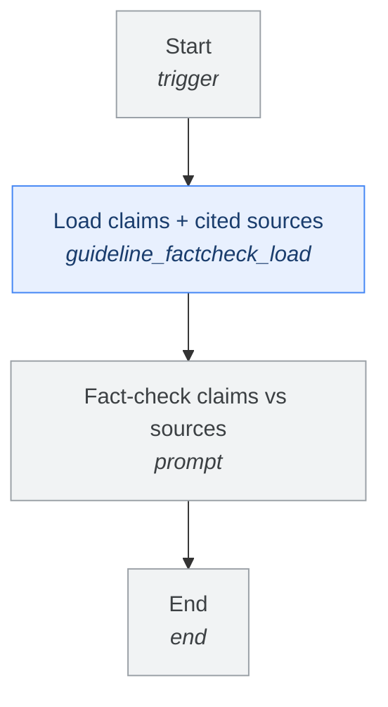
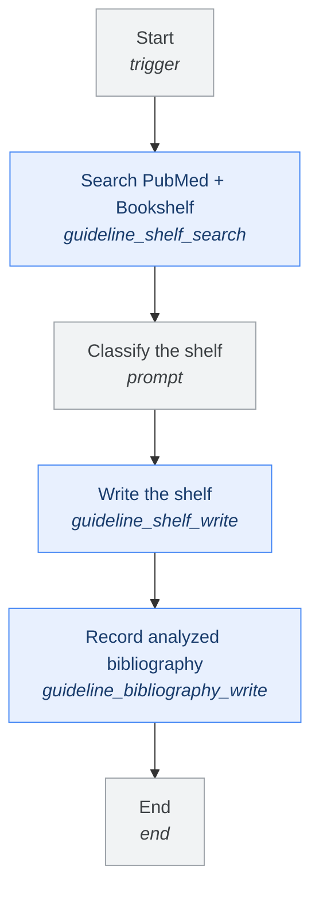
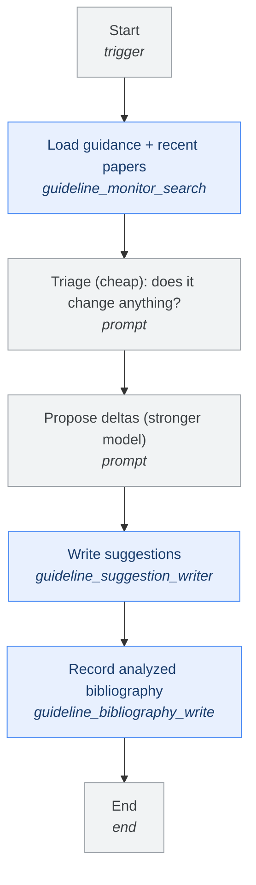
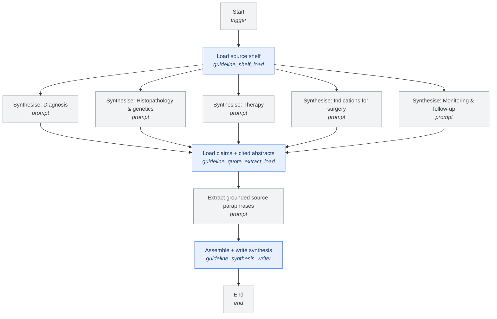
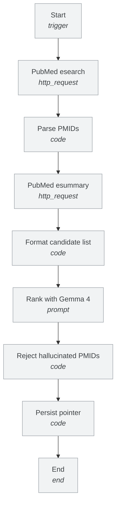

# Flows

> Generated from `backend/flows/specs/*.json` by
> `python3 -m backend.scripts.render_flow_diagrams`. Do not edit by hand — the
> specs are what the engine actually executes, so they are the source of truth
> and this file is only a view of them. `--check` fails when the two drift.

Colours follow the executor domain packages: **guidelines** (blue), **doctors** (green), **pathways** (amber), shared core (grey).

## guideline_factcheck

Fact-check pass (research pipeline step 4): for each synthesis paragraph, verify against the abstract of the source it cites whether the claim is actually supported. Produces a per-paragraph verdict report (supported / unsupported / uncertain) as the run output — a pre-pass for the domain expert before publication, not a public data write. Set gfc-check.model_name to a stronger model for the judgement.

## guideline_shelf_build

Build the curated source shelf for a disease (step 1 of the research pipeline). Broadly searches PubMed + NCBI Bookshelf, an LLM classifies which documents belong on the shelf and the role of each (base consensus / update / subtopic / reference compendium), and the writer replaces guideline_source_documents. The synthesis flow (guideline_synthesis) consumes this shelf. Deterministic recall validation lives OUTSIDE the workflow (scripts/validate_shelf_fd.py).

## guideline_suggestions

Level-b monitor (research pipeline step 3): find recent literature beyond the shelf, triage cheaply for whether each paper changes the guideline vs what the synthesis ALREADY says, then a (stronger) model proposes deltas — additions/modifications beyond current guidance. Empty is a valid answer. Budget-disciplined: bounded candidate set, cheap Gemma triage, strong model only on the short list. Deterministic checks live in tests/scripts, not here.

## guideline_synthesis

Synthesis over a curated source shelf (epistemic level a). Loads the disease's source documents + abstracts, synthesises one section per node strictly from the shelf (provenance per paragraph), and the terminal writer assembles + upserts the synthesis into the GL-4 guideline_synthesis table. The anti-hallucination critic backbone (pmid_verify / source_doc_verify / evaluation_check) is wired in GL-ENGINE-2.

## official_guidelines_finder

Auto-discover the recognised international consensus paper for a disease. Triggers when a new disease is added; promotes its top-ranked PubMed result into the official-guideline pointer block once a reviewer confirms.

